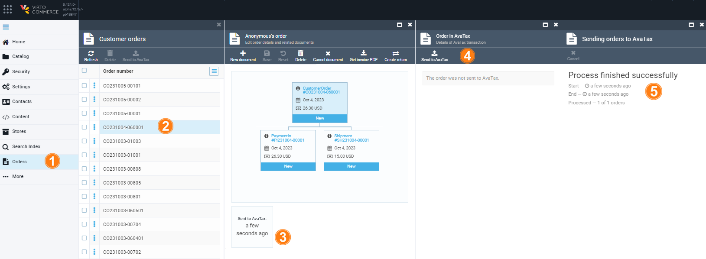
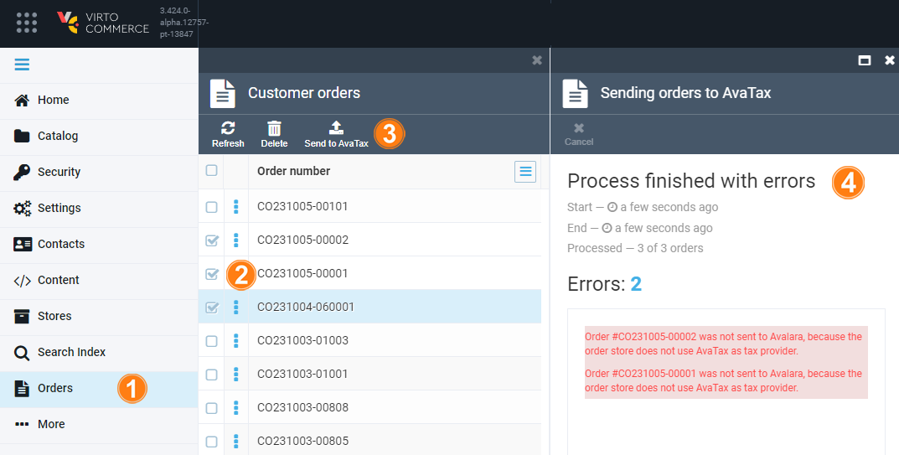
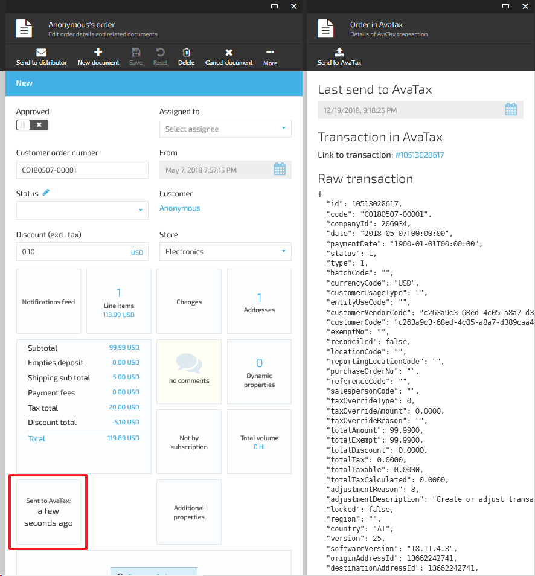

# Orders Synchronization

The AvaTax module creates AvaTax transactions for orders and enables scheduled synchronization of VC Platform orders with AvaTax. 

It creates a **SalesInvoice** transaction for orders, where:

* Document code matches order number.
* Document date matches order date.
* Line items contain all line items from the order plus one more line item for the shipping.

You can send the order to AvaTax:

* Automatically: 
    * Enable the `Avalara.Tax.ScheduledOrdersSynchronization.IsEnabled` setting.
    * Adjust the schedule in the `Avalara.TaxScheduledOrdersSynchronization.CronExpression` setting.
    * Wait for the job to complete.
* Manually:
    * For a single order: 
        1. In the main menu, click **Orders** to open the **Order details** blade.
        1. Click the required order.
        1. In the **Edit order details** blade, click the **AvaTax** widget.
        1. Click **Send to AvaTax** in the **Details of AvaTax transaction** blade.
        1. The report of the process results appears in the next blade.
        
        {: style="display: block; margin: 0 auto;" }

    * For multiple orders: 
        1. In the main menu, click **Orders** to open the **Order details** blade.
        1. Check the required orders.
        1. Click **Send to AvaTax** in the top menu.
        1. The report of the process results appears in the next blade. The orders are sent to Avalara only for the stores that use AvaTax as their tax provider.

        {: style="display: block; margin: 0 auto;" width="700"}

!!! note
    * Set **AvaTax** as a tax provider for your store to send transactions to AvaTax.

To review the AvaTax transaction details for the order, click the **AvaTax** widget in the order details blade. 

It displays:

* The date the order was sent to AvaTax.
* The link to the AvaTax transaction corresponding to the order.
* Raw AvaTax transaction representation.

{: style="display: block; margin: 0 auto;" width="700"}

 
 
********

    <a href="../overview">← Avalara module overview </a>
    <a href="../taxes-calculation">Taxes calculation →</a>

