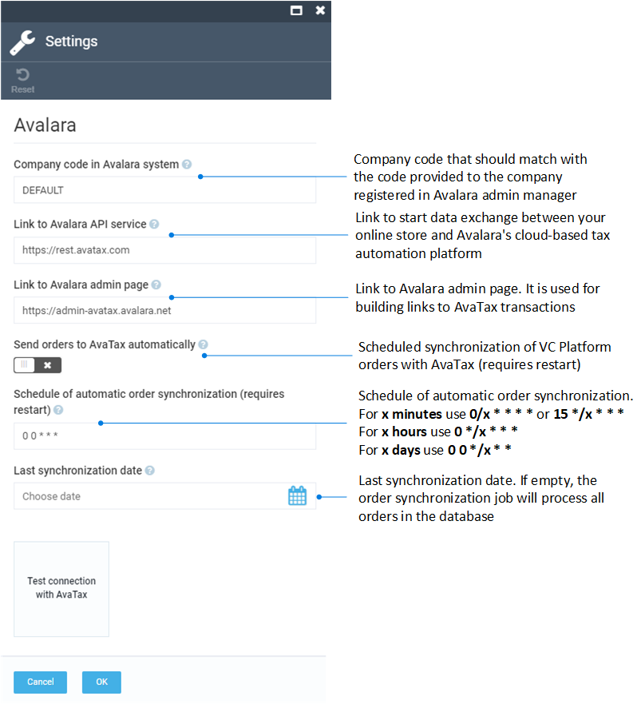

# Settings

1. In the main menu, click **Stores** to open the **Stores** blade.
1. Select the required store.
1. In the **Store details** blade, click the **Tax providers** widget.
1. Click **Avalara Tax Provider**. Make sure the **Is active** option is checked.
1. In the **Edit tax provider** blade, click **Settings**.

    

1. Fill in the following fields:

    {: width="700"}

1. Click **OK** to save the changes.
