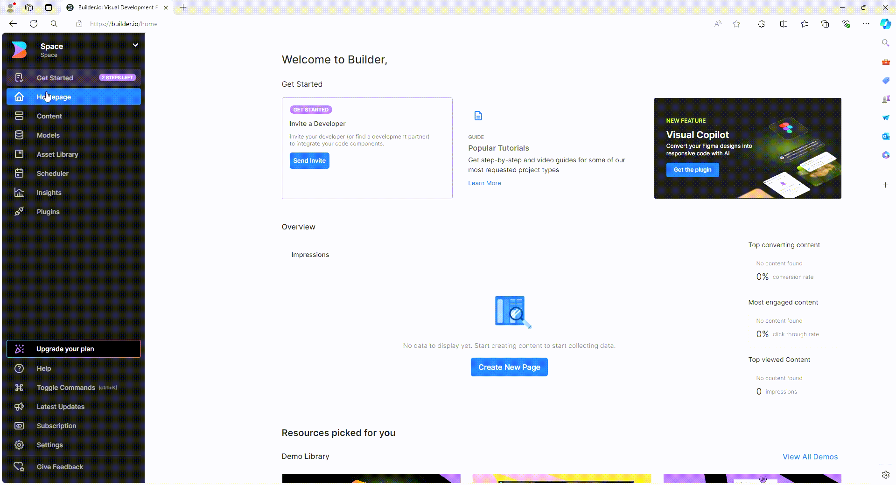
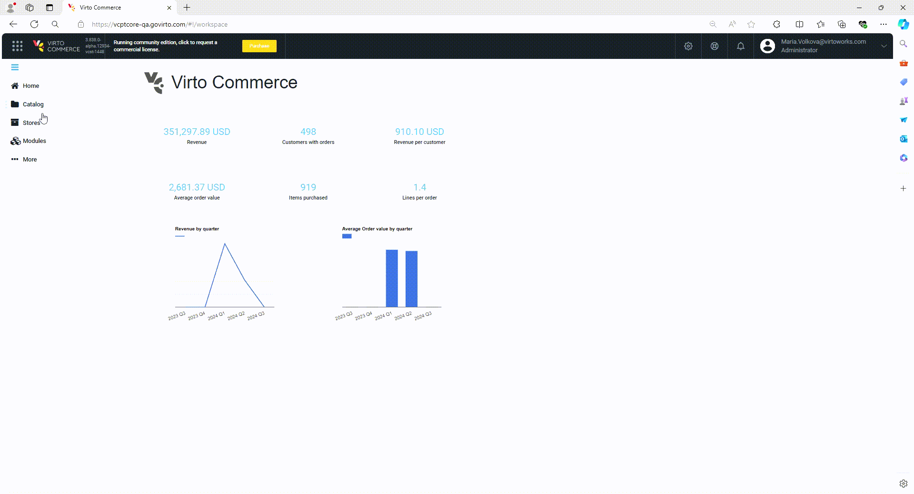
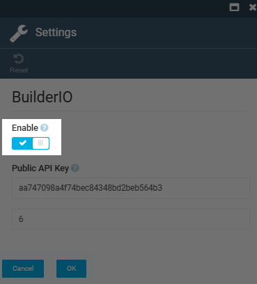
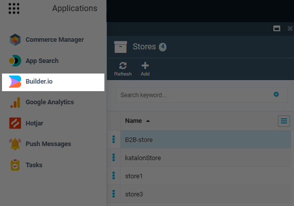

# Getting Started

This guide demonstrates how to enable Builder.io in the Platform and assign an API key to a specific store.

## Prerequisites

* Create your [Builder.io account](https://www.builder.io/).
* [Create a space in Builder.io](https://www.builder.io/c/docs/ui-tour#selecting-and-creating-organizations-and-spaces). For demonstration purposes, we will choose **Publish** space type.

## Enable Builder.io and assign API key to store

To start using the Builder.io solution for a specific store:

1. Copy the public API key in the Builder.io settings:

    {: style="display: block; margin: 0 auto;" }

1. Paste the copied API key into the Platform: 

    1. Go to **Platform--> Stores --> Your store --> Settings widget --> BuilderIO settings**.
    1. Paste the copied API key into the appropriate field.

    {: style="display: block; margin: 0 auto;" }

1. Enable the Builder.io switch:

    {: style="display: block; margin: 0 auto;" }

1. Click **OK**.

Click on the link to start using Builder.io:

{: style="display: block; margin: 0 auto;" }

 
 
********

    <a href="../overview">← Builder.io module overview </a>
    <a href="../use-builder-io">Use Builder.io →</a>

