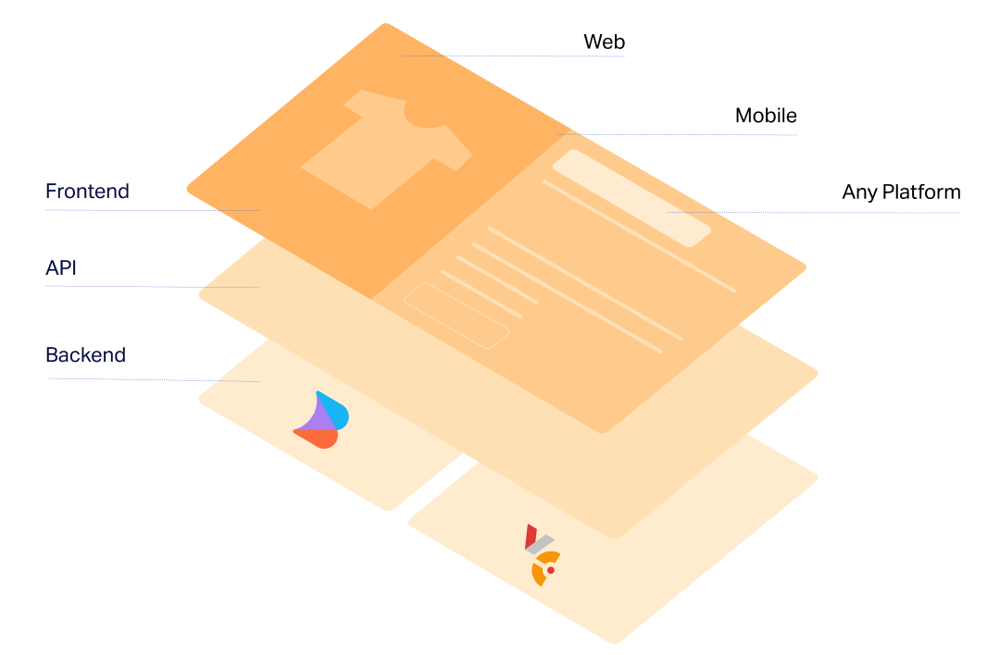

# Overview

The Virto Commerce Builder.io module adds link to Builder.io to the application menu. By clicking on it, users immediately access the toolkit for transforming Frontend Application page designs into optimized web and mobile experiences.

{: width="25"} [How builder.io works](https://www.builder.io/c/docs/how-builder-works)

{: width="25"} [Integrating custom components with Builder.io](https://www.builder.io/c/docs/custom-components-intro)

Virto Commerce and Builder.io integrate seamlessly via API. Once connected, Builder.io pulls in content components like text, images, videos, and carousels, which are then displayed in your online storefront alongside commerce modules from Virto Commerce — such as stock availability, pricing, customer reviews, and shipping information.

Your e-commerce team can efficiently use existing code components and the design system from the Virto Commerce frontend as building blocks, enabling faster development while maintaining brand consistency. In addition, they can utilize Builder’s pre-built blocks to create customized experiences 

{: width="650"}

Developers can easily register new Virto frontend components in code, allowing business team members to use the Builder’s visual editor to drag and drop these components to create content-rich experiences with no dev support. These components can be reused and built into templates, speeding the launch of new pages.

Once the content is complete in the Builder's visual editor, Virto's prerendering functionality allows your online storefront to generate static versions of pages in advance, smoothing the development process, speeding load times, reducing server load, and simplifying SSR.

## Key features

The diagram below illustrates the relationships within the Virto Commerce Content Management System:

With the Builder.io module, you can:

* Configure your Frontend Application.
* Enable/disable it in the Platform.
* Assign public API key to a specific store.
* Transfer components designed in Figma directly to Builder.io with just a few clicks.

The module is ready for integration with other sales channels.

 
 
********

    <a href="../../avalara/overview">← Avalara module overview </a>
    <a href="../getting-started">Getting started →</a>

