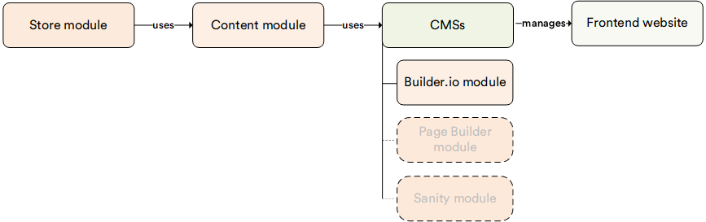

# Overview

The **Builder.io** module adds link to Builder.io to the application menu. By clicking on it, users immediately access the toolkit for transforming Frontend Application page designs into optimized web and mobile experiences.

{: width="25"} [How builder.io works](https://www.builder.io/c/docs/how-builder-works)

{: width="25"} [Integrating custom components with Builder.io](https://www.builder.io/c/docs/custom-components-intro)

## Key features

The diagram below illustrates the relationships within the Virto Commerce Content Management System:

{: style="display: block; margin: 0 auto;" }

With the Builder.io module, you can:

* Configure your Frontend Application.
* Enable/disable it in the Platform.
* Assign public API key to a specific store.
* Transfer components designed in Figma directly to Builder.io with just a few clicks.

The module is ready for integration with other sales channels.

{: width="25"} [Builder.io setup](../../../../developer-guide/Extensibility/cms-integrations/builder-io-setup)

 
 
********

    <a href="../../avalara/overview">← Avalara module overview </a>
    <a href="../use-builder-io">Using Builder.io →</a>

