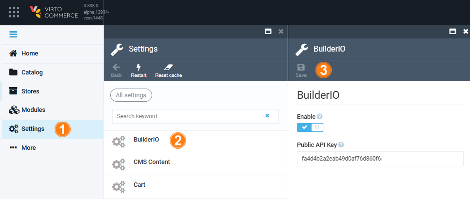

# Settings

To configure Builder.io settings:

1. Click **Settings** in the main menu.
1. In the next blade, select **BuilderIO**.
1. Enable/disable Builder.io or add/edit API key, then click **Save** in the top toolbar.

The modifications have been saved.

 
 
********

    <a href="../use-builder-io">← Using Builder.io </a>
    <a href="../../google-analytics/overview">Google Analytics module overview →</a>

