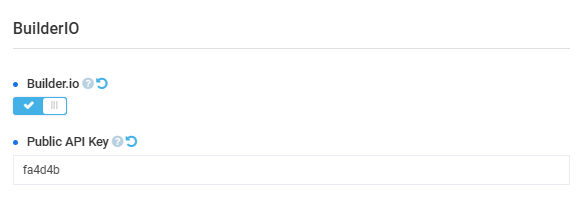

# Settings

To configure Builder.io settings:

1. Open **Stores** from the main menu.
1. In the next blade, select  your store.
1. In the next blade, click on the **Settings** widget.
1. Find **BuilderIO** settings in the left panel and configure the following

    {: style="display: block; margin: 0 auto;" }

1. Click **Save** in the toolbar to save the changes.

The modifications have been applied.

 
 
********

    <a href="../use-builder-io">← Using Builder.io </a>
    <a href="../../google-analytics/overview">Google Analytics module overview →</a>

