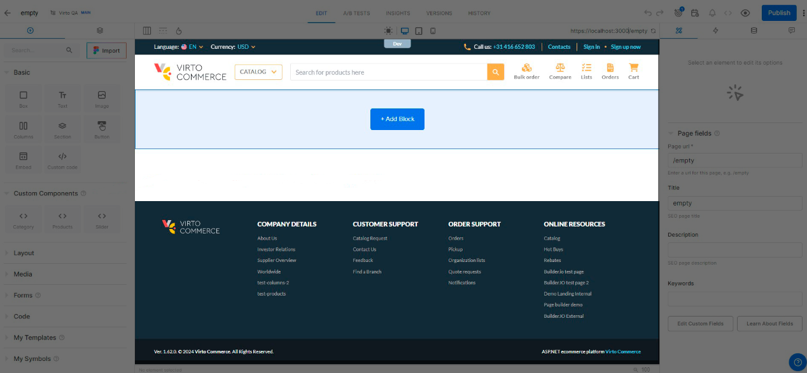
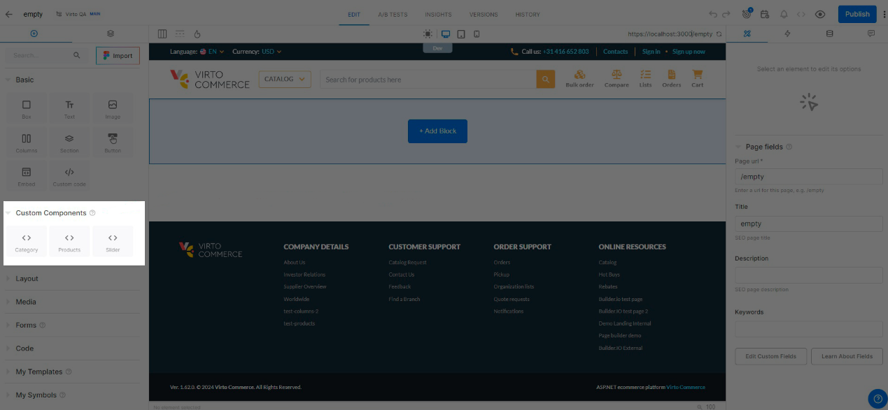
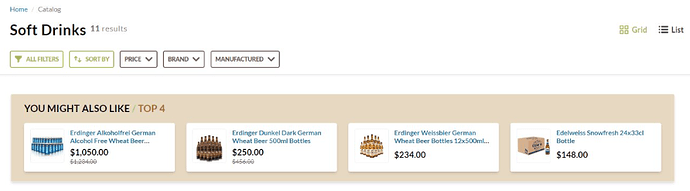
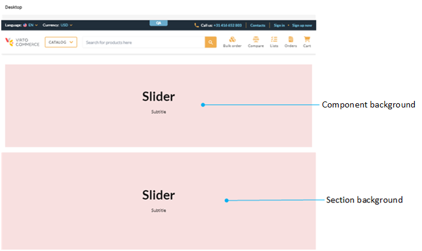
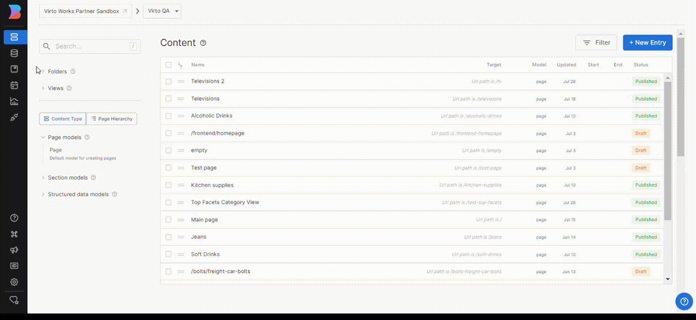

# Use Builder.io

Builder.io is an intuitive solution that allows anyone on your team to manage Frontend Application pages without having to rely on developers. As long as Virto Frontend Application has native integration with Builder.io, you can start using it right away:

1. Open Platform.
1. Click {: width="25"} to open applications menu.
1. Click **Builder.io**. The Builder.io dashboard opens in a new window. 
1. If required, select a space from the list.
1. Click **New entry** to [create a new page](https://www.builder.io/c/docs/create-page#creating-a-page). 

    !!! note
        At this step, you may need to add site URL. Go to **Settings** --> **Space** tab --> **Site URL** --> **Edit**

1. The newly created page already contains a header and a footer that maintain the UI and design of the Virto Frontend Application:

    

    The left sidebar contains builder.io components and Virto Commerce custom components. If necessary, users can [add their own custom components](https://www.builder.io/c/docs/custom-components-intro) or edit the existing ones:

    

    For example, you can add an **N-pinned products** component to a custom category page. You can create fully customized category pages that include not only standard products but also specifically curated products that remain pinned:

    

{: width="25"} [Builder.io user guide](https://www.builder.io/c/docs/start-building)

## Copy components from Figma

Thanks to the Builder.io Figma plugin, any user can copy components designed in Figma and paste them into a page edited in Builder.io:

1. [Run Builder.io plugin in Figma](https://help.figma.com/hc/en-us/articles/360042532714-Use-plugins-in-files).
1. Click on the component you want to copy to your Builder.io edited page.
1. Open the Builder.io plugin.
1. Click **Copy to Builder**.
1. Open the page you are editing in Builder.io.
1. Press **Ctrl+V** on the page where you want to paste the copied component.

    

The selected component has been pasted to your Builder.io edited page.

## Customize background color

With Builder.io, you can customize both component and section color:

For a solid color throughout, edit the section color: 

1. Disable **Components-only-mode** switch:

    

1. Create new page.
1. Add a section to your new page.
1. In the right sidebar, click on the **layout** tab.
1. Click **Background** and set a color you need.
1. Add the required components to your newly created section.

