# Use Builder.io

Builder.io is an intuitive solution that allows anyone on your team to manage Frontend Application pages without having to rely on developers. As long as Virto Frontend Application has native integration with Builder.io, you can start using it right away:

1. Open Platform.
1. Click {: width="25"} to open applications menu.
1. Click **Builder.io**. The Builder.io dashboard opens in a new window. 
1. If required, select a space from the list.
1. Add site URL. Go to **Settings** --> **Space** tab --> **Site URL** --> **Edit**. Paste your site URL, then click **Submit**.
1. Add preview URL. Go to **Content models** --> **Page**. Paste your **Preview URL**, then click **Save**. 

1. Click **New entry** to [create a new page](https://www.builder.io/c/docs/create-page#creating-a-page). 

1. Open your newly created page. It already contains a header and a footer that maintain the UI and design of the Virto Frontend Application:

    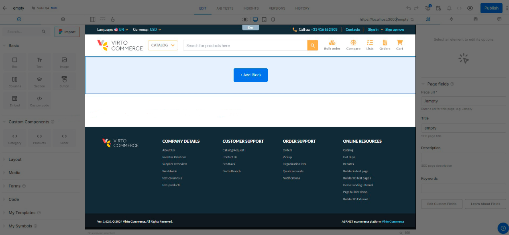{: style="display: block; margin: 0 auto;" }

    The left sidebar contains builder.io components and [Virto Commerce custom components](use-builder-io.md#virto-commerce-custom-components). If necessary, users can [add their own custom components](https://www.builder.io/c/docs/custom-components-intro) or edit the existing ones:

    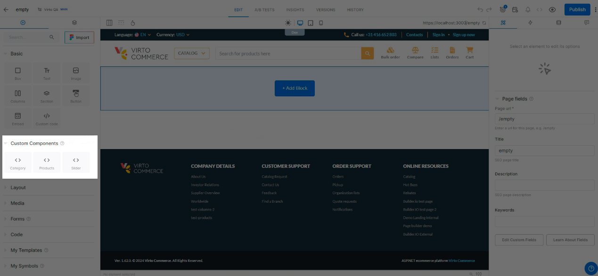{: style="display: block; margin: 0 auto;" }

    For example, you can add an **N-pinned products** component to a custom category page. You can create fully customized category pages that include not only standard products but also specifically curated products that remain pinned:

    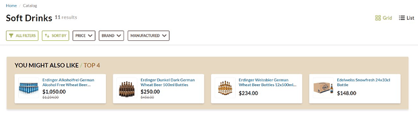{: style="display: block; margin: 0 auto;" }

{: width="25"} [Builder.io user guide](https://www.builder.io/c/docs/start-building)

### Virto Commerce custom components

The custom components by Virto include:

-   __Breadcrumbs:__

    ---

    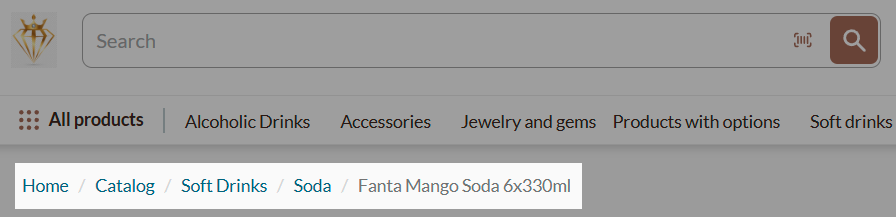{: width="650" }

-   __Category:__

    ---

    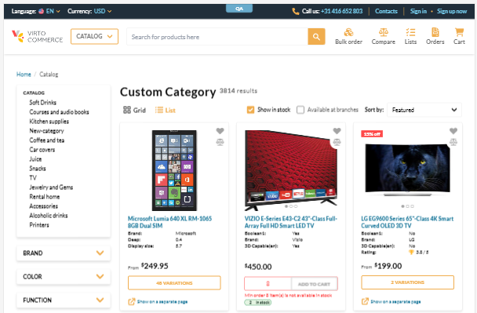

-   __Favorite products:__

    ---

    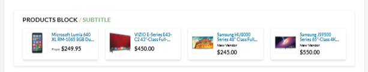

-   __Predefined products:__

    ---

    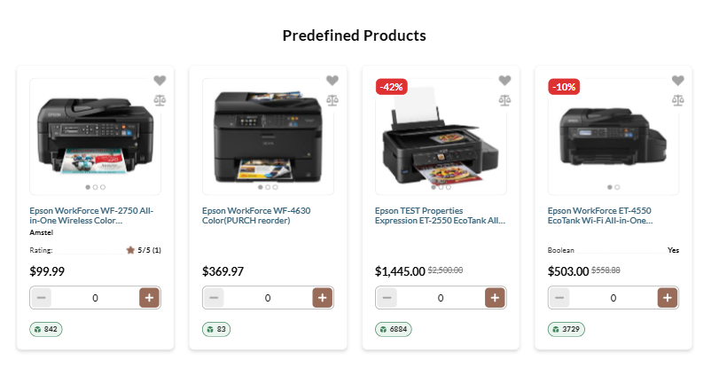

-   __Products:__

    ---

    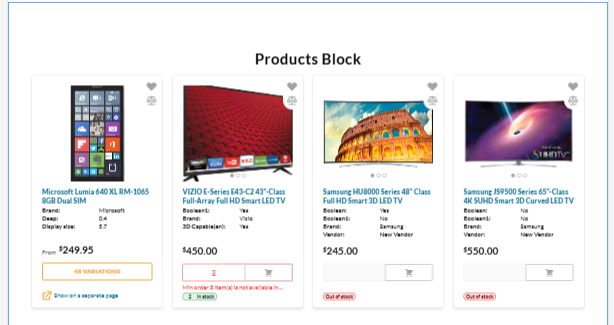

-   __Products carousel:__

    ---

    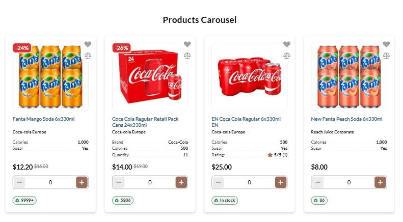

-   __Slider:__

    ---

    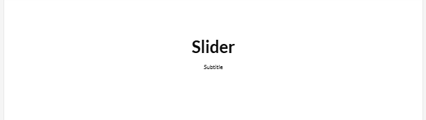

-   __VC-container:__

    ---

    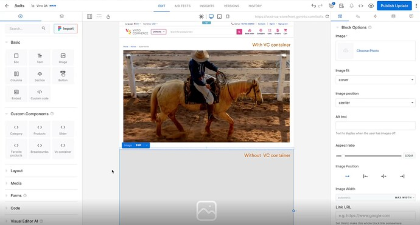

    Allows images to be uploaded in a format fully supported by the Frontend. Eliminates the need for further resizing to fit other elements.

!!! note 
    To add products to the **Predefined products** or **Products carousel** custom components, enter the products' SKUs:

    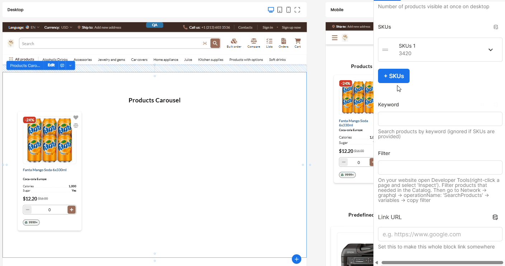

## Add category block with subcategory filters

1. Add the **Category** custom component to your field.
1. Click **Edit**.
1. Find the **Filter** field and follow the instruction how to fill it in.
1. On your website, open Developer Tools (right-click a page and select **Inspect**). 
1. Filter products that are needed in your catalog. 
1. Go to **Network** --> **graphql** --> **operationName: "SearchProducts"** --> **variables** --> copy filter
1. Paste it to the **Filter** field.

Now you can see your category with the required results.

??? Demo
    

## Copy components from Figma

Thanks to the Builder.io Figma plugin, any user can copy components designed in Figma and paste them into a page edited in Builder.io:

1. [Run Builder.io plugin in Figma](https://help.figma.com/hc/en-us/articles/360042532714-Use-plugins-in-files).
1. Click on the component you want to copy to your Builder.io edited page.
1. Open the Builder.io plugin.
1. Click **Copy to Builder**.
1. Open the page you are editing in Builder.io.
1. Press **Ctrl+V** on the page where you want to paste the copied component.

    

The selected component has been pasted to your Builder.io edited page.

## Customize background color

With Builder.io, you can customize both component and section color:

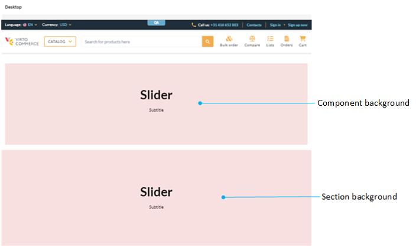{: style="display: block; margin: 0 auto;" }

For a solid color throughout, edit the section color: 

1. Disable **Components-only-mode** switch:

    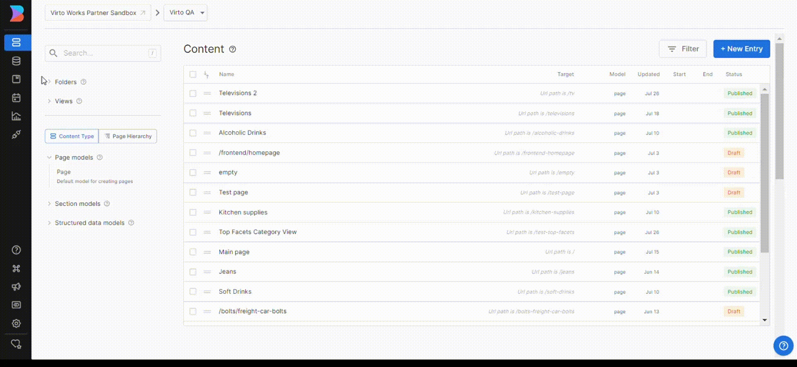{: style="display: block; margin: 0 auto;" }

1. Create new page.
1. Add a section to your new page.
1. In the right sidebar, click on the **layout** tab.
1. Click **Background** and set a color you need.
1. Add the required components to your newly created section.

{: style="display: block; margin: 0 auto;" }

## Customize pages for specific users

Users can customize pages for different organizations so that each organization’s users see only the content intended specifically for them.
For example, let's configure separate homepages so that users from the Melon organization see one version, while users from the Mercury organization see another:

  
  

    <iframe loading="lazy" class="sl-demo" src="https://virtocommerce.storylane.io/demo/dtb2e4lf9t9j?embed=popup" name="sl-embed" allow="fullscreen" allowfullscreen style="position:absolute;top:0;left:0;width:100%!important;height:100%!important;border:1px solid rgba(63,95,172,0.35);box-shadow: 0px 0px 18px rgba(26, 19, 72, 0.15);border-radius:10px;box-sizing:border-box;"></iframe>
  

## Troubleshooting

If you are trying to change the formatting of the header and it does not react, try to refresh your preview.

??? Demo
    {: style="display: block; margin: 0 auto;" }

 
 
********

    <a href="../overview">← Builder.io overview </a>
    <a href="../settings">Settings →</a>

