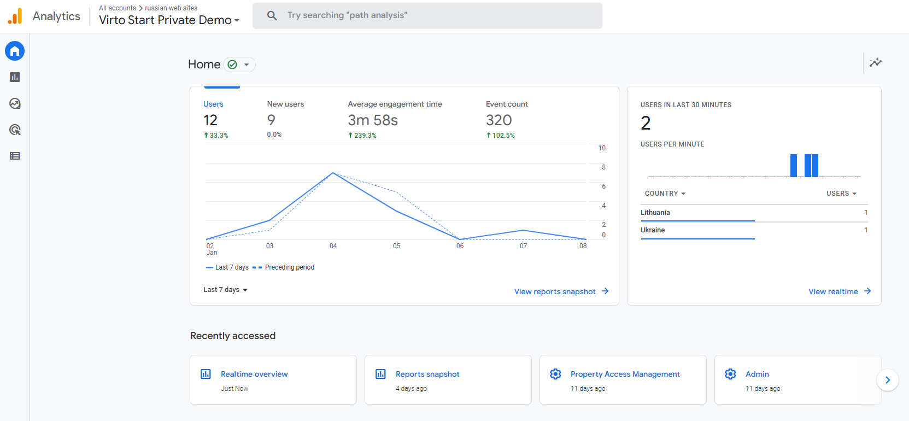

# Integration with Google Analytics 4

Virto Commerce Frontend Application has native integration with Google Analytics 4 module.

To install it and assign Google Analytics Measurement Id for you store:

1. Create Google Analytics Account according to the [Instruction](https://support.google.com/analytics/answer/9304153)

    
    
1. In the main menu, click **Stores** to open the **Stores** blade.
1. Select the required store.
1. In the **Store details** blade, click on the **Settings** widget.
1. Enable Google Analytics 4.
1. Enter your measurement Id. 

    

1. Save the **Store Settings** to activate the Google Analytics tracking.

    
