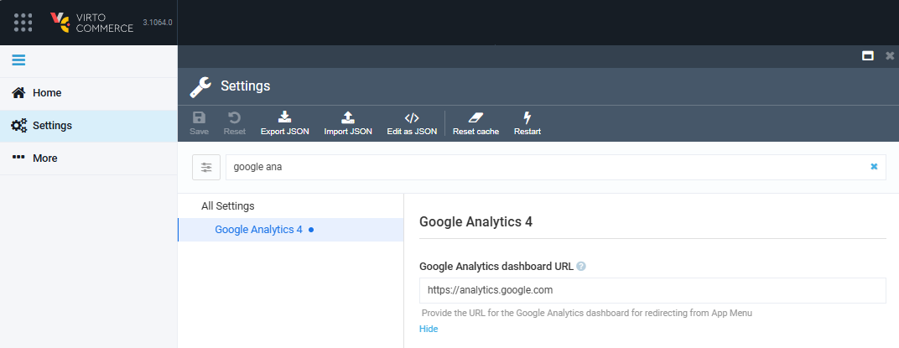
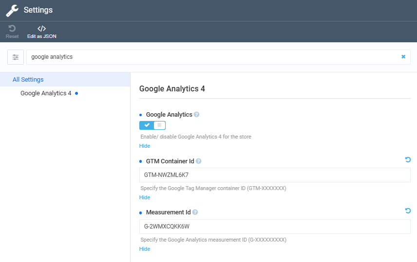

# Settings

The **Google Analytics 4** module settings include:

* [General settings.](#general-settings)
* [Store-specific settings.](#search-settings)

## General settings

To configure general settings:

1. Click **Settings** in the main menu.
1. In the search field of the next blade, type **Google Analytics** to find the settings related to the module.
1. Provide the URL for the Google Analytics dashboard for redirecting from App Menu:

	{: style="display: block; margin: 0 auto;" }

1. Click **Save** in the toolbar to save the changes.

The modifications have been applied.

## Store-specific settings

To configure store-specific settings: 

1. Click **Stores** in the main menu.
1. Select your store.
1. In the next blade, click **Settings** widget.
1. In the next blade, type **Google Analytics** to find the settings related to the module.
1. Configure the following fields.

	{: style="display: block; margin: 0 auto;" }

1. Click **OK**, then **Save** in the toolbar to save the changes.

The modifications have been applied.

 
 
********

    <a href="../integration">← Using Google Analytics </a>
    <a href="../../hotjar/overview">Hotjar module overview →</a>

