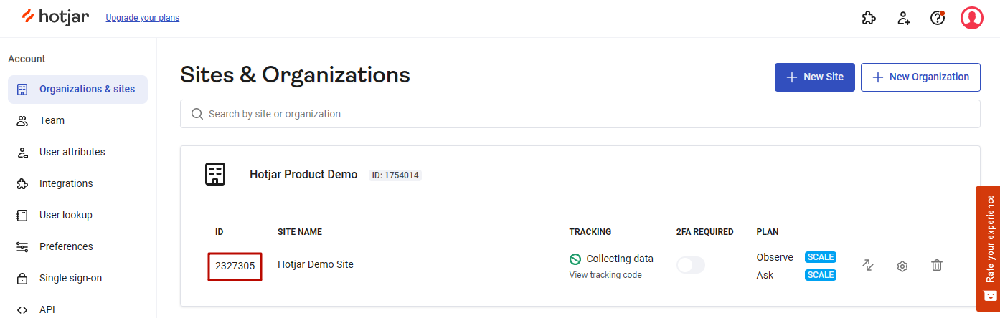
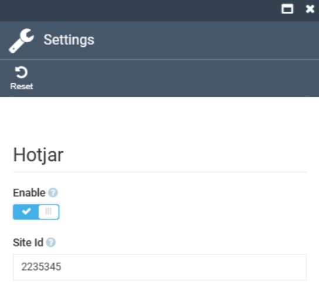
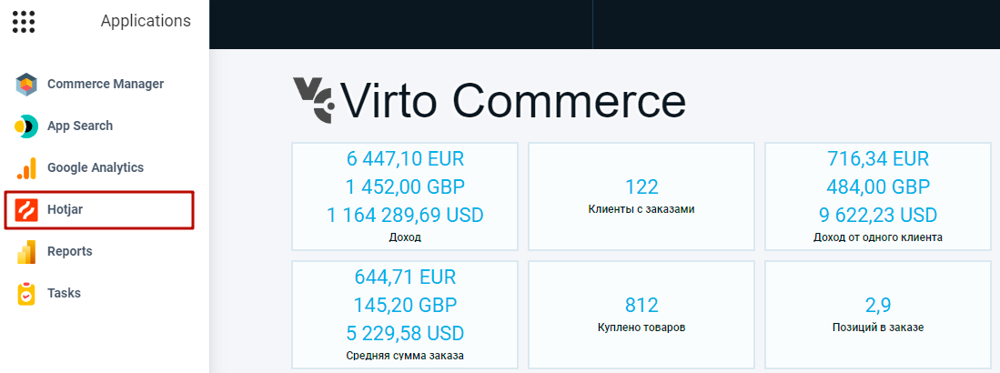

# Get Started

Virto Commerce Frontend Application has native integration with the Hotjar module.

To start using Hotjar:

1. [Create and сonfigure Hotjar Account](https://www.hotjar.com/).
1. Save your site Id.

    {: style="display: block; margin: 0 auto;" }

1. Open the Platform and go to **Stores** to select the required store.
1. In the new blade, select the Settings widget.
1. Enable Hotjar option and enter your Store Id.

    {: style="display: block; margin: 0 auto;" width="300" }

1. Click **OK**, than click **Save** to activate Hotjar tracking.

The module adds Hotjar link into Applications menu. It redirects to Hotjar Dashboard.

{: style="display: block; margin: 0 auto;" }


!!! note
    To request Hotjar configuration for store, you can use Rest API.
    
    * **Endpoint**: /api/hotjar/{storeId}

    * **Method**: GET
    
    * **Request parameter**: Store Id    
    
    * **Response**:   
    
    ```
    {
    "enableTracking": true,
    "siteId": "2235345",
    "hotjarVersion": 6
    }
    ```


<br>
<br>
********

<div style="display: flex; justify-content: space-between;">
    <a href="../overview">← Hotjar module overview </a>
    <a href="../../power-bi/overview">Power BI Reports module overview →</a>
</div>