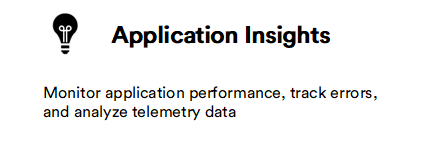

# Overview

Virto Commerce offers strategic integrations with notable platforms, including Google Analytics, Hotjar, Builder.io, and Avalara Tax. These integrations contribute significantly to enhancing data analysis, user experience evaluation, and tax management for businesses seeking a robust ecommerce solution.

|Tool|Description|
|---|---|
|  |   <ul><li> [Start using Application Insights](../application-insights/enable-app-insights.md)</li></ul>|
|  |  <ul><li> [Use search analytics](../elastic-app-search/using-analytics.md)</li><li> [Tune search relevance](../elastic-app-search/search-relevance-tuning.md)</li> </ul>|
|  |  <ul><li> [Synchronize Platform orders with AvaTax](avalara/orders-synchronization.md)</li><li> [Calculate taxes](avalara/taxes-calculation.md) </li> <li>[Configure tax type](avalara/tax-type-configuration.md)</li></ul>|
| |  <ul><li>[Enable Builder.io and Assign API Key to Store](builder-io/getting-started.md)</li><li>[Customize your Frontend Application website](builder-io/use-builder-io.md)</li> <li>[Copy components from Figma](builder-io/use-builder-io.md#copy-components-from-figma)</li></ul>|
|  |  <ul><li> [Activate GA tracking](google-analytics/integration.md)</li><li> [Configure GA settings](google-analytics/settings.md) </li></ul>|
|  |  <ul><li> [Start using Hotjar](google-analytics/integration.md)</li> </ul>|
|  |  <ul><li> [Start using Power BI](power-bi/getting-started.md)</li> </ul>|

