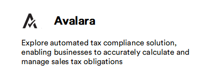
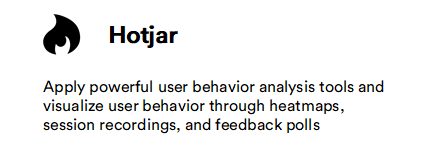

# Overview

Virto Commerce offers strategic integrations with notable platforms, including Google Analytics, Hotjar, and Avalara Tax. These integrations contribute significantly to enhancing data analysis, user experience evaluation, and tax management for businesses seeking a robust e-commerce solution.

|Tool|Description|
|---|---|
|  | <ul><li> [Synchronize Platform orders with AvaTax](avalara/orders-synchronization.md)</li><li> [Calculate taxes](avalara/taxes-calculation.md) </li> <li>[Congigure tax type](avalara/tax-type-configuration.md)</li></ul>|
|  | <ul><li> [Activate GA tracking](google-analytics/integration.md)</li><li> [Configure GA settings](google-analytics/settings.md) </li></ul>|
|  | <ul><li> [Start using Hotjar](google-analytics/integration.md)</li> </ul>|
|  | <ul><li> [Create and schedule push messages](../push-messages/manage-push-messages.md#create-and-schedule-push-message)</li><li> [Clone messages](../push-messages/manage-push-messages.md#clone-message) </li> <li>[View message status](../push-messages/manage-push-messages.md#view-message-status)</li></ul>|
