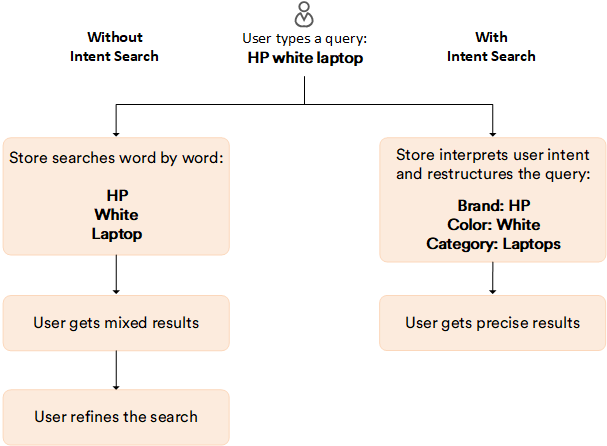
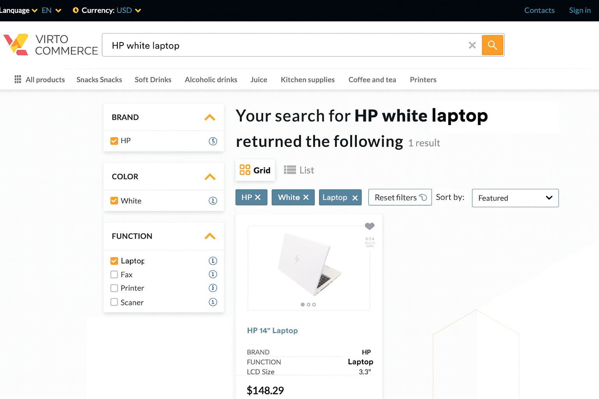

# Overview

Virto Commerce **Intent Search** is an advanced AI-powered search intent classification and product categorization module that intelligently analyzes search queries and classifies products for ecommerce platforms. Built with enterprise-grade multi-tenancy, performance monitoring, and flexible configuration capabilities, it transforms how your platform understands customer search intent and categorizes products:
 
 
{: style="display: block; margin: 0 auto;" }
 
 
As a result, the shopper sees more accurate and highly relevant products on the Frontend:

{: style="display: block; margin: 0 auto;" width="850"}

 
 

{: width="20"} [Intent Search installation](/platform/developer-guide/Fundamentals/Intent-Search/installation-and-configuration)

 
 
********

    <a href="../../search/overview">← Search module overview</a>
    <a href="../../elastic-search-9/overview">Elasticsearch 9 module overview →</a>

