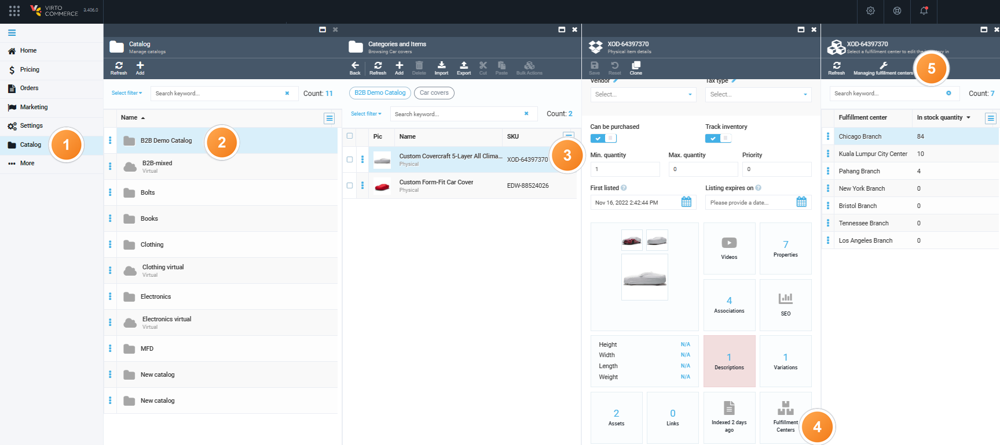
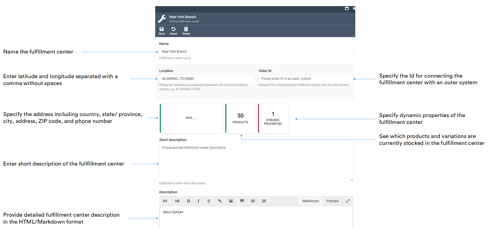
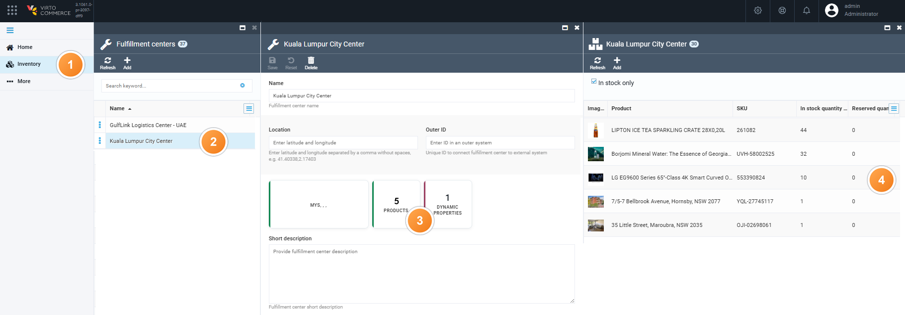

# Manage Fulfillment Centers

Fulfillment centers are processing units involved in receiving, processing, and delivering orders to end customers. The fulfillment process in ecommerce includes the following steps:

* Receiving goods from a supplier.
* Storing the received goods.
* Processing customer orders.
* Shipping the orders to customers.

To start managing fulfillment centers:

1. Click **Catalog** in the main menu to open the list of catalogs.
1. Select the relevant catalog in the **Catalog** blade.
1. In the next **Categories and Items** blade, select the product.
1. On the product page, click the **Fulfillment centers** widget.
1. In the next blade, click **Managing fulfillment centers** in the toolbar to view the list of fulfillment centers. 

	{: style="display: block; margin: 0 auto;" }

Now you can:

* [Edit inventory in each fulfillment center.](managing-inventory.md)
* [Add and edit fulfillment centers.](managing-fulfillment-centers.md#add-and-edit-fulfillment-center)
* [Delete fulfillment centers.](managing-fulfillment-centers.md#delete-fullfillment-center)
* [View products stocked in a fulfillment center.](managing-fulfillment-centers.md#view-products-in-fulfillment-center)

## Add and edit fulfillment center

In the list of fulfillment centers:

1. Click the fulfillment center you need to edit or **Add** to add a new one. This opens **Editing fulfillment center** blade.
1. Fill in the following fields
1. Fill in the fields:

	{: style="display: block; margin: 0 auto;" }

1. Click **Save** in the toolbar to save the changes.

The modifications have been saved.

## View products in fulfillment center

To see which products and variations are currently stocked in a specific fulfillment center:

1. Click **Inventory** in the main menu.
1. Select the fulfillment center you want to check in the **Fulfillment centers** blade. This opens the fulfillment center's editing blade.
1. Click the **Products** widget.
1. Review the list of products and variations with a non-zero quantity in this fulfillment center, along with their SKU, in-stock quantity, and reserved quantity.

	{: style="display: block; margin: 0 auto;" }

The **Products** widget shows the total count of such items. Clear the **In stock only** checkbox to also include products with a zero quantity.

!!! note
	The **Products** widget only requires the `inventory:read` permission. The list itself also needs `catalog:read` to resolve product names.

	Without `catalog:read`, the widget still shows the correct count, but list opens with no rows and no column headers.

### Add products to fulfillment center

In the fulfillment center's **Products** blade:

1. Click **Add** in the toolbar. This opens a picker with the catalog's list of products and variations.
1. Select the products or variations to add to this fulfillment center.

The selected items appear in the fulfillment center's product list. 

{: width="20"} [Managing inventory](/platform/user-guide/inventory/managing-inventory)

## Delete fulfillment center

In the list of fulfillment centers:

1. Click:
	* Three dots to the left of each item in the fulfillment center list and click **Delete** from the popup menu.
	* The fulfillment center you need to delete and then click **Delete** in the new blade.

1. Confirm the deletion. 

The fulfillment center has been permanently removed.

 
 
********

    <a href="../managing-inventory">← Managing inventory</a>
    <a href="../settings">Inventory module settings →</a>

