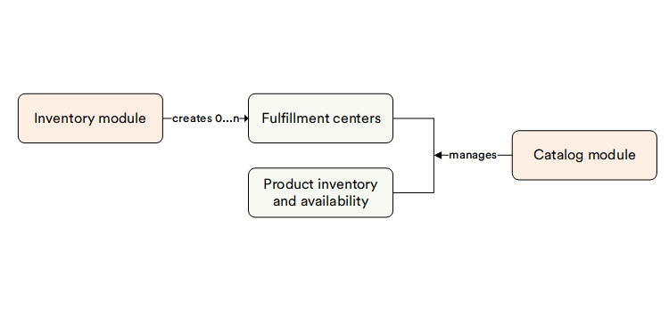

# Overview

The Inventory module enables tracking the stock level and managing fulfillment centers.

In the ecommerce sector, day-to-day inventory management helps increase business intelligence and visibility. eCommerce business owners have better ongoing control when they constantly keep an eye on their inventory.

## Key features

The diagram below illustrates the Inventory module functionality:

With the Inventory module, you can:

* [Track inventory and stock](managing-inventory.md)
* [Manage fulfillment centers](managing-fulfillment-centers.md)
* [Manage product availability](../catalog/setting-product-availability.md)
* [Customize your inventory module](settings.md)