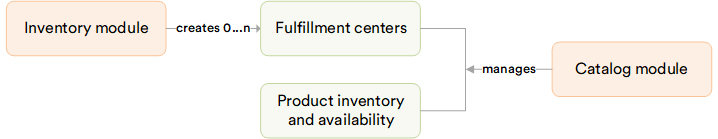

# Overview

The **Inventory** module enables tracking the stock level and managing fulfillment centers.

This is not a WMS (Warehouse Management System): it tracks a stock quantity per fulfillment center, not bin locations, putaway, pick lists, wave picking, or cycle counts. For those, integrate a dedicated WMS against the fulfillment center as the shared location reference.

In the ecommerce sector, day-to-day inventory management helps increase business intelligence and visibility. eCommerce business owners have better ongoing control when they constantly keep an eye on their inventory.

## Key features

The diagram below illustrates the Inventory module functionality:

{: style="display: block; margin: 0 auto;" }

With the Inventory module, you can:

* [Track inventory and stock](managing-inventory.md).
* [Manage fulfillment centers](managing-fulfillment-centers.md).
* [Manage product availability](../catalog/setting-product-availability.md).
* [Customize your inventory module](settings.md).

 
 
********

    <a href="../../pricing/overview">← Pricing module overview</a>
    <a href="../managing-inventory">Managing inventory →</a>

