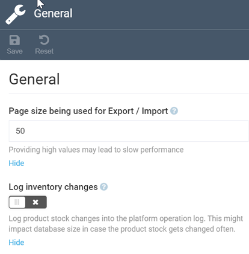

# Settings

The Inventory module settings include:

* [General settings.](settings.md#general-settings)
* [Search settings.](settings.md#search)

## General settings

To configure general settings:

1. Click **Settings** in the main menu.
1. Type **Inventory** to find the settings related to the module.
1. Select **General** to configure the page size for export or import and enable/ disable logging of inventory changes:

	

1. Click **Save** in the toolbar to save the changes.

The modifications have been saved.

## Search settings

To configure search settings: 

1. Click **Settings** in the main menu.
1. Type **Inventory** to find the settings related to the module.
1. Select **Search** to enable or disable event-based indexing.

	

1. Click **Save** in the toolbar to save the changes.

The modifications have been saved.

