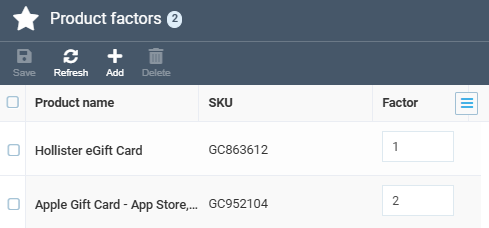
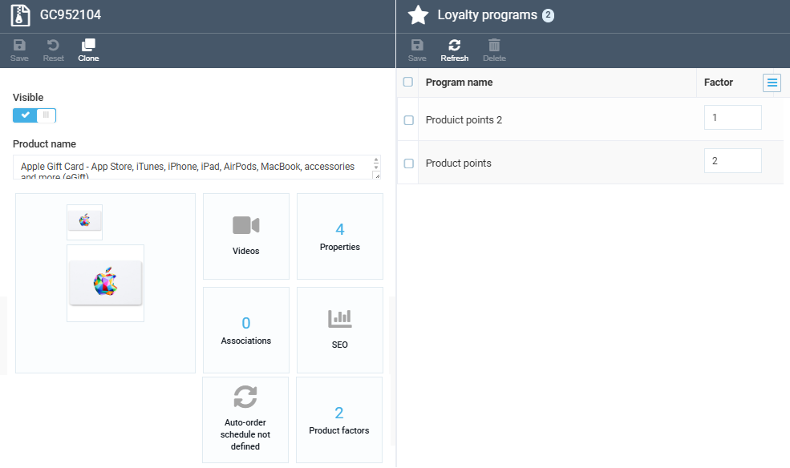

# Configure Loyalty Points per Product

The **Loyalty** module lets store managers show how many loyalty points a customer can earn when browsing the catalog. The earnable amount is calculated per product, and you can apply different multiply factors to specific customer groups.

!!! note
    This feature controls display only. The actual point accrual on order placement is configured separately through loyalty programs.


For each product, the earnable amount uses this formula:

```
Loyalty points = (Product price − Discount) × Multiply factor
```

The multiply factor is taken from the first matching active Product Points loyalty program, sorted by priority in descending order. If no program defines a factor for the product, the store-level default multiply factor is applied.

## Configuration steps

To configure loyalty points per product:

1. [Enable loyalty on the store.](#enable-loyalty-on-the-store)
1. [Create a product points loyalty program](enable-and-configure-loyalty-programs.md#create-product-points-loyalty-program). Add at least one condition specific to this program type:

    * **User group is …**: Apply the program only to customers in the listed groups, for example VIP or LUX.
    * **Any User Group**: Apply to any customer who belongs to at least one user group.

    After you save your product points program, the **Product factors** widget becomes available on the program details.

1. Add product factors:

    1. In the program details blade, click the **Product factors** widget.
    1. In the **Product factors** blade, click **Add**.
    1. Select the products that should use a custom factor, then click **Add selected**.
    1. For each row, enter the multiply factor in the **Factor** column. Whole numbers and decimals are both accepted, for example 5, 0.5, or 2.75. Negative values are rejected with a red highlight, and the **Save** button stays disabled.

        {: style="display: block; margin: 0 auto;" }

    1. Click **Save** in the toolbar.


Your modifications have been saved. 

A product can have a factor in several programs at the same time, for example one factor for VIP and another for LUX:

{: style="display: block; margin: 0 auto;" }

The factor used at runtime depends on which program matches the customer's groups first by priority. Within a single program, a product can have only one factor row.

<br>
<br>
********

<div style="display: flex; justify-content: space-between;">
    <a href="../set-up-loyalty-catalog-browsing">← Setting up loyalty catalog browsing</a>
    <a href="../loyalty-points-history">Loyalty points history →</a>
</div>