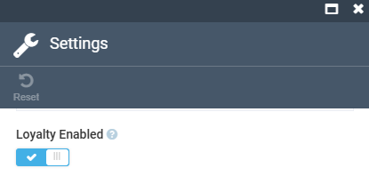
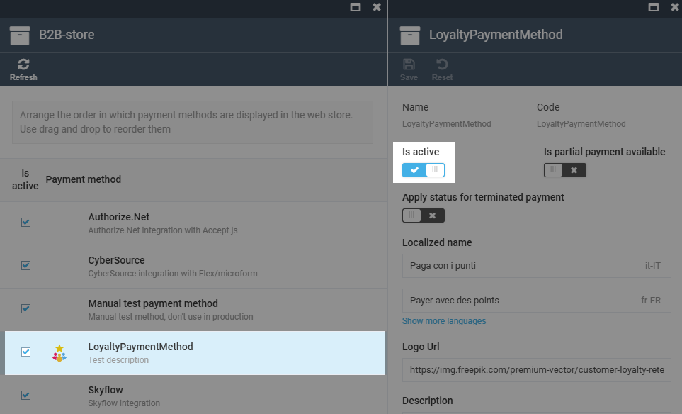
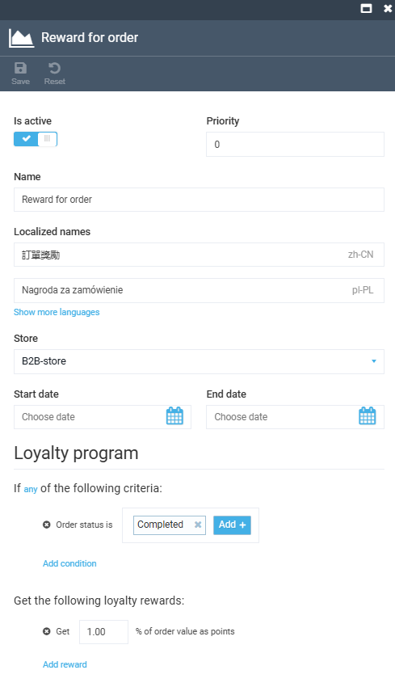
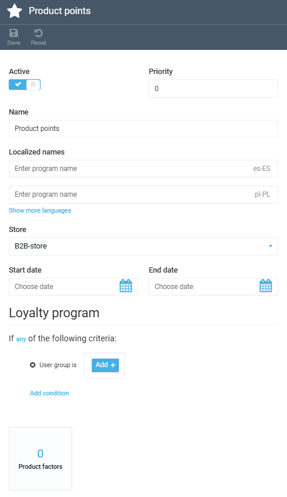

# Enable and Create Loyalty Programs

To start using loyalty features:

1. [Enable loyalty on the store.](#enable-loyalty-on-the-store)
1. Create one or both program types:

    * [Order loyalty.](#create-order-loyalty-program)
    * [Product points loyalty.](#create-product-points-loyalty-program)

## Enable loyalty on the store

Enable loyalty in the store settings:

1. In the main menu, click **Stores**.
1. Select your store.
1. In the next blade, click the **Settings** widget.
1. Turn the **Loyalty enabled** option to on, then click **OK**.
1. Click **Save** in the toolbar.

{: style="display: block; margin: 0 auto;" }

To let customers pay with points, activate the loyalty payment method:

1. In the store settings blade, click the **Payment methods** widget.
1. Select **Loyalty payment method**.
1. Turn the **Is active** option to on.
1. Click **Save** in the toolbar.

{: style="display: block; margin: 0 auto;" width="800"}

## Create order loyalty program

An **Order loyalty** program awards points when an order meets the program conditions:

1. In the main menu, click **Loyalty**.
1. Click **Add** in the toolbar.
1. In the **Add loyalty program** blade, select **Order loyalty**.
1. Fill in the program details:

    * **Active**: Toggle on to make the program live.
    * **Name**: Required. The **Save** button stays disabled until you enter a name.
    * **Store**: Select the store the program applies to.
    * **Priority**: Sets the order in which programs are evaluated when several match.
    * **Start date** and **End date**: Optional active date range.

1. Under **If any of the following criteria**, click **Add condition** and choose the earning rules:

    * **Order status is**: Award points when the order reaches a status, for example Completed.
    * **Order total**: Award points when the order value meets a threshold.
    * **Is first order**: Award points on the customer's first purchase.
    * **Is recurring order**: Award points on repeat purchases.
    * **Is registration**: Award points when a customer registers.

    You can add several conditions. Any matching condition triggers the reward.

1. Under **Get the following loyalty rewards**, configure the reward:

    * **Fixed points**: A flat points amount per qualifying order.
    * **% of order value as points**: A percentage of the order total converted to points.

    {: style="display: block; margin: 0 auto;" }

1. Click **Save** in the toolbar.

Your order loyalty program has been created.

## Create product points loyalty program

A Product Points Loyalty program awards points for purchasing specific products. The number of points is calculated per product using a multiply factor.

1. In the main menu, click **More**, then click **Loyalty**.
1. Click **Add** in the toolbar.
1. In the **Add loyalty program** blade, select **Product Points Loyalty**.
1. Fill in the program details (**Active**, **Name**, **Store**, **Priority**, **Start date**, **End date**) as for an Order Loyalty program.
1. Under **If any of the following criteria**, click **Add condition** and choose a condition specific to this type:

    * **User group is …**: Apply the program only to customers in the listed groups, for example VIP or LUX.
    * **Any user group**: Apply to any customer who belongs to at least one user group.

1. Click **Save** in the toolbar to save the changes.

After saving your loyalty program, the **Product factors** widget appears at the bottom of the program details blade:

{: style="display: block; margin: 0 auto;" }

Now, you can set the per-product multiply factors that determine how many points each product earns.

{: width="25"} [Configuring loyalty points per product](configuring-loyalty-points-per-product.md)

 
 
********

    <a href="../overview">← Loyalty module overview</a>
    <a href="../set-up-loyalty-catalog-browsing">Set up loyalty catalog browsing →</a>

