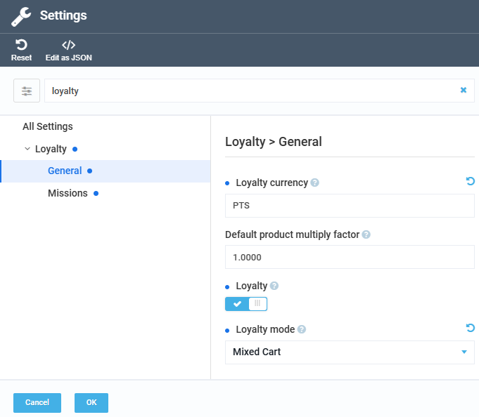
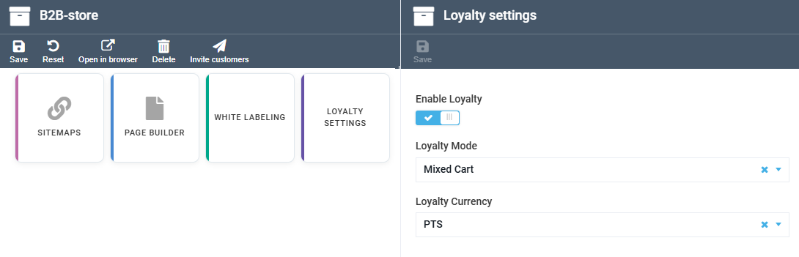
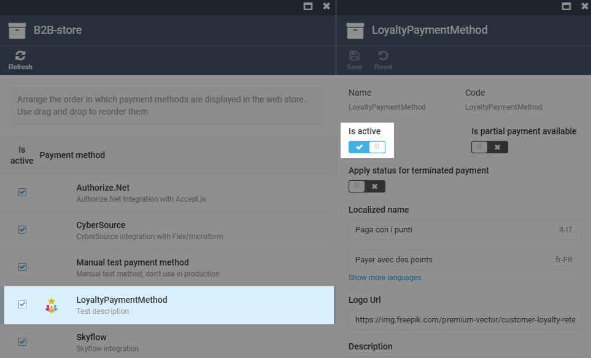
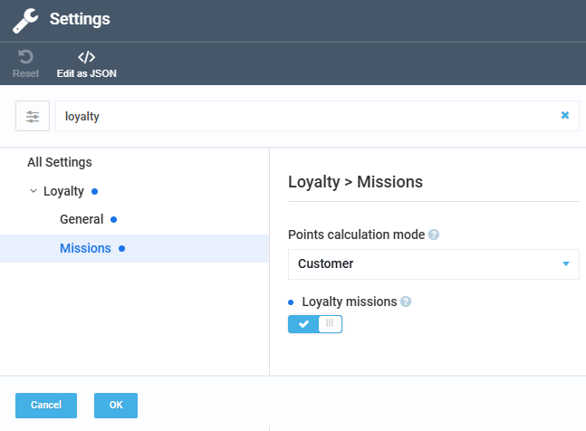

# Enable Loyalty Features

Users can enable the following loyalty features:

* [Enabling loyalty programs.](#enable-loyalty-programs)
* [Enabling loyalty payments.](#enable-loyalty-payments)
* [Enabling loyalty missions.](#enable-loyalty-missions)

## Enable loyalty programs

To enable loyalty programs for your store:

1. Click **Stores** in the main menu.
1. Select your store.
1. In the next blade, click the **Settings** widget.
1. In the next blade, type **Loyalty** to find settings related to the feature.
1. Select **General** settings. 
1. Turn the **Loyalty** option to on, then click **OK**.
1. Click **Save** in the toolbar.

{: style="display: block; margin: 0 auto;" }

Alternatively, loyalty programs can be enabled via the loyalty settings widget:

1. Click **Stores** in the main menu.
1. Select your store.
1. In the next blade, click the **Loyalty settings** widget.
1. In the next blade, turn the **Loyalty** option to on.
1. Click **Save** in the toolbar.

{: style="display: block; margin: 0 auto;" }

Loyalty is now enabled for the store. You can proceed with creating and managing loyalty programs.
 
 
{: width="20"} [Creating loyalty programs](enable-and-configure-loyalty-programs.md)

## Enable loyalty payments

To allow customers to pay for their orders using loyalty points, activate the **Loyalty payment method**:

1. In the store settings blade, click the **Payment methods** widget.
1. Select **Loyalty payment method**.
1. Turn the **Is active** option to on.
1. Click **Save** in the toolbar.

{: style="display: block; margin: 0 auto;" width="800"}

The **Loyalty payment method** is now enabled, allowing customers to pay for eligible orders with their loyalty points.

## Enable loyalty missions

To enable loyalty missions for the store:

1. Click **Stores** in the main menu.
1. Select your store.
1. In the next blade, click the **Settings** widget.
1. In the next blade, type **Loyalty** to find settings related to the feature.
1. Select **Missions** settings. 
1. Turn the **Loyalty missions** option to on, then click **OK**.

    {: style="display: block; margin: 0 auto;" }

1. Click **Save** in the toolbar.

Loyalty missions have been enabled for the store.
 
 
{: width="20"} [Creating loyalty missions](managing-loyalty-missions.md)

 
 
********

    <a href="../overview">← Loyalty module overview</a>
    <a href="../enable-and-configure-loyalty-programs">Creating loyalty programs →</a>

