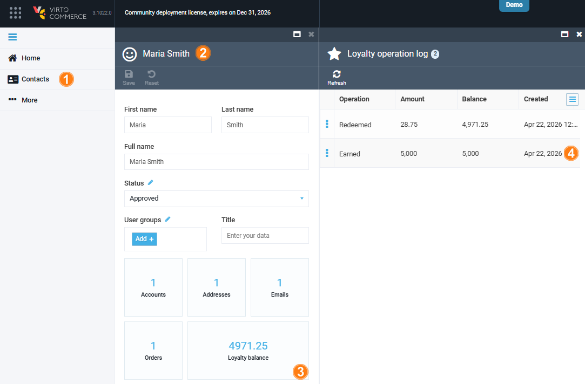
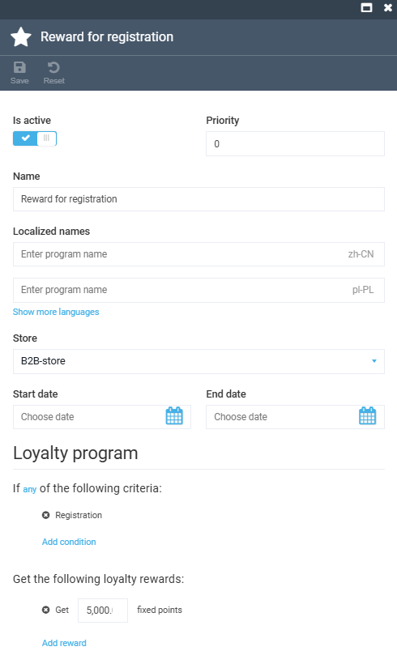

# Loyalty Points History

To view how many loyalty points a user has earned or redeemed:

1. Open **Contacts** from the main menu.
1. In the next blade, find the user whose loyalty history you want to view.
1. In the user details blade, click the **Loyalty balance** widget to open the loyalty operations log:

    {: style="display: block; margin: 0 auto;" }

1. Click any item to view its details:

    {: style="display: block; margin: 0 auto;" }

The user's loyalty points history is now displayed.

 
 
********

    <a href="../enable-and-configure-loyalty-programs">← Enabling and configuring loyalty programs</a>
    <a href="../../news/overview">News module overview →</a>

