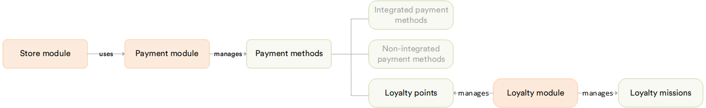

# Overview

The **Loyalty** module provides a flexible loyalty program management system for the Virto Commerce Platform. It enables store managers to define loyalty programs, reward customers with points, track transactions, and allow customers to pay for their orders using loyalty points.

## Key features

The diagram below illustrates the payment options within the Virto Commerce Platform:

With the Loyalty module, users can:

* **Manage programs**: Create and configure two program types. **Order Loyalty** rewards customers based on order conditions, and **Product Points Loyalty** rewards them with points for purchasing specific products. Both support conditions, reward rules (fixed points or % of order value), priorities, activation periods, and localized names.
* **Reward specific products**: Assign per-product multiply factors and vary them by customer group, so different tiers, for example VIP or LUX, earn points at different rates.
* **Show earnable points**: Display how many points a customer can earn for a product while browsing the catalog.
* **Offer a loyalty catalog**: Present a dedicated catalog where products are priced in loyalty points instead of the store's standard currency.
* **Track transactions**: Log point accruals and redemptions, and monitor customer activity and balance changes.
* **Enable loyalty payments**: Use the built-in **LoyaltyPaymentMethod** to let customers pay with points at checkout.
    * Points can only be used if the balance fully covers the order amount.
    * Conversion rate: **1 point = 1 unit of order currency**.

 
 
********

    <a href="../../intent-search/overview">← Intent Search module overview</a>
    <a href="../enable-and-configure-loyalty-programs">Enabling and configuring loyalty programs →</a>

