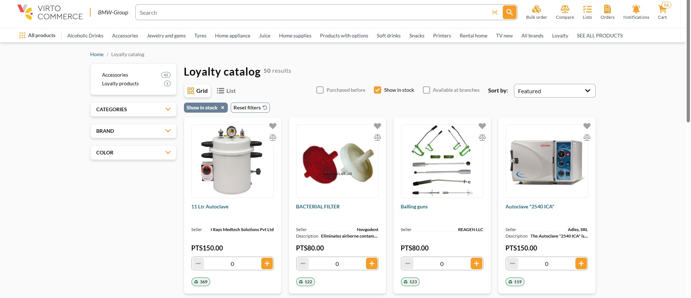
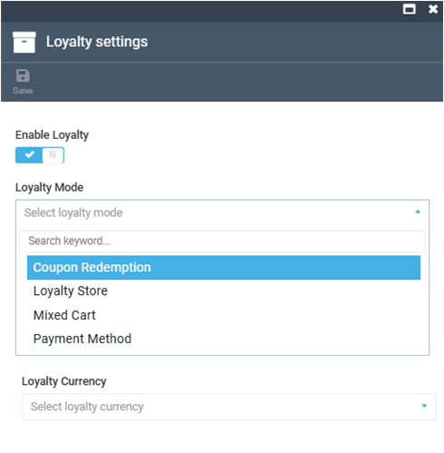

# Set Up Loyalty Catalog Browsing

The **Loyalty catalog** is a dedicated section of the Frontend where products are priced in loyalty points rather than the store's standard currency:

Customers with points:

* Browse a separate product grid at **/loyalty-catalog**.
* See prices shown in points on every product card and product page.
* Move through the catalog using the same category structure as the standard store. 

The catalog is fully isolated, so browsing it does not change prices or links in the standard store at **/catalog**.

## Prerequisites

Before configuring the module, make sure you have access to the Platform with permissions to edit the following modules:

* **Stores**.
* **Pricing**.
* **Loyalty**.

## Set up loyalty catalog browsing

To set up loyalty catalog browsing:

1. [Enable loyalty and set the mode.](#enable-loyalty-and-set-mode)
1. [Create a points price list and price your products.](#create-points-price-list-and-price-your-products)
1. [Create loyalty programs.](create-loyalty-program.md)

### Enable loyalty and set mode

Enable loyalty on the store and choose a mode that exposes the catalog:

1. In the main menu, click **Stores**.
1. In the next blade, select the store you want to configure.
1. In the store details blade, click the **Loyalty settings** widget.
1. Turn the **Enable loyalty** option to on.
1. In the **Loyalty mode** dropdown, select one of the following options:
    
    * **Mixed cart** to display a standard-currency catalog and a loyalty catalog side by side.
    * **Loyalty store** for a loyalty-focused store where the points catalog is the primary offering.
    * **Coupon redemption** to redeem the points as coupon codes at checkout without browsable catalog.
    * **Payment method** to use points as a payment method at checkout without a browsable catalog.

1. In the **Loyalty currency** field, enter your points currency code, for example PTS. This field must not be empty.

    {: style="display: block; margin: 0 auto;" }

1. Click **Save** in the toolbar.

Your changes have been applied.

### Create points price list and price your products

Products appear in the loyalty catalog only if they carry a price in your loyalty currency. Products without a points price are not shown.

1. In the main menu, click **Pricing**.
1. In the next blade, select **Price lists**.
1. Click **Add** to [create a price list](../pricing/creating-new-price-list.md#create-new-price-list). Give it a descriptive name and set the currency to your points currency.
1. [Add a price for each product](../pricing/creating-new-price-list.md) you want in the loyalty catalog, entering the points amount.
1. [Assign the price list](../pricing/adding-new-assignment.md) to your store and catalog.
1. Click **Save** in the toolbar.

!!! note
    Only products with a points price greater than 0 appear in the loyalty catalog. Products priced at 0 are filtered out.

Your points price list has been created.

## Troubleshooting

| Problem                                | Resolution                                                                                                              |
| -------------------------------------- | ----------------------------------------------------------------------------------------------------------------------- |
| The loyalty catalog shows a 404 page   | Check that **Enable loyalty** is enabled for the store. Verify that **Loyalty mode** is set to **Mixed Cart** or **Loyalty Store**, not **Coupon Redemption** or **Payment Method**. Ensure that **Loyalty currency** is configured. If you recently updated the value, save the settings again. |
| A product is missing from the loyalty catalog  | Verify that the product has a points price greater than 0 in the loyalty points price list. If necessary, add or correct the entry in **Pricing**. Also verify that the points price list is assigned to the correct store and catalog.                                                          |
| The Loyalty programs blade is missing from the More menu | Verify that the **Loyalty** module is installed on the Platform instance and that your account has the required permissions. Contact your Platform administrator if necessary.  |
| A program is not awarding points    | Verify that the program's **Active** toggle is enabled. Check the **Start date** and **End date** to ensure the current date falls within the active period. Confirm that the program condition matches the order status reached by the order.     |

 
 
********

    <a href="../enable-and-configure-loyalty-programs">← Enabling and configuring loyalty programs</a>
    <a href="../configuring-loyalty-points-per-product">Configuring loyalty points per product →</a>

