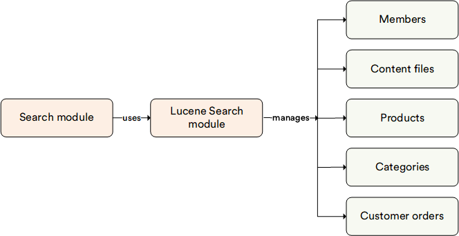

# Overview 

The **Lucene Search** module serves as a search engine within the Search module. It stores indexed documents in a local file system, making it suitable for local development environments. While it is recommended primarily for use in development mode due to its local storage nature, it can also serve as a lightweight option for smaller-scale deployments.

## Key features

The diagram below illustrates the functionality of the Lucene Search module:

 
 
********

    <a href="../../algolia/overview">← Algolia Search module overview</a>
    <a href="../../azure-search/overview">Azure Search module overview →</a>

