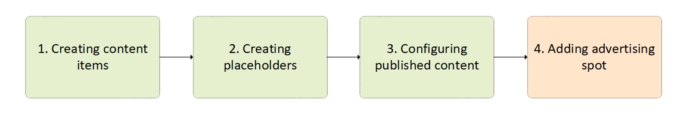

# Add Advertising Spot

Adding advertising spot to your website or online store is your last step to bringing your marketing content online:



This involves adding a specific piece of HTML code that will actually publish your content and make it visible for your customers. 

To add the dynamic content to your website:  

1. Open your web page HTML file.
1. Insert the following code into the file, the ID being the name of the relevant placeholder:

```html
<vc-content-place id="Right banner 240x400" class="col-sm-4 col-md-4 rightblock">
</vc-content-place>
```

Your marketing content has been brought online.