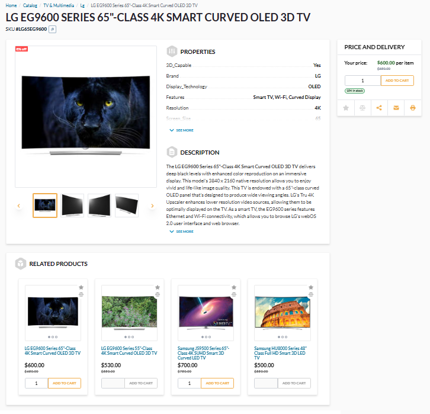

# Overview

Dynamic product associations refer to the establishment of connections between products based on predefined rules or conditions rather than fixed relationships. These associations are flexible and automatically adapt to changes in product inventory or attributes. For example, if a customer adds a laptop to their cart, the system automatically suggests relevant products that might interest the customer. This dynamic approach enhances the shopping experience, increases cross-selling opportunities, and streamlines product management:

!!! note 
    Managing dynamic product associations requires preinstalled [Dynamic Associations module](https://github.com/VirtoCommerce/vc-module-dynamic-associations/releases).

{: width="25"} [Dynamic Associations module](../dynamic-associations/overview.md)

With the dynamic product associations feature, you can:

* Select a product to promote as a related product or an accessory.
* Select products with which the promoted items will appear.
* Control the display of promoted products and determine their sorting order.

 
 
********

    <a href="../advertising-spot">← Adding advertising spot</a>
    <a href="../managing-dynamic-associations">Managing dynamic associations →</a>

