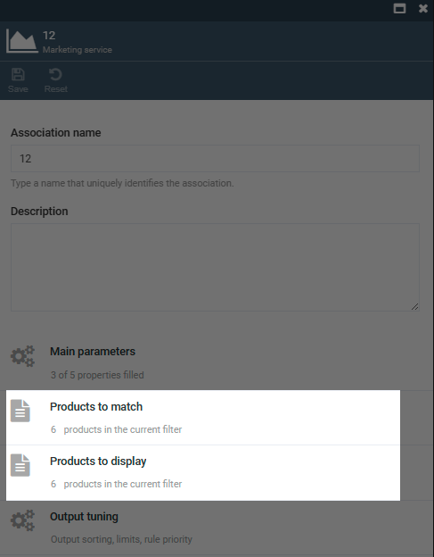
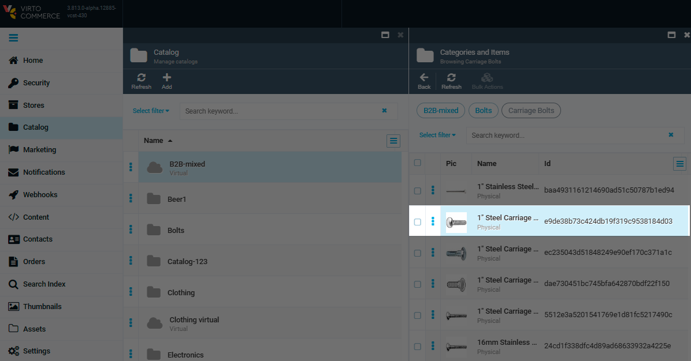
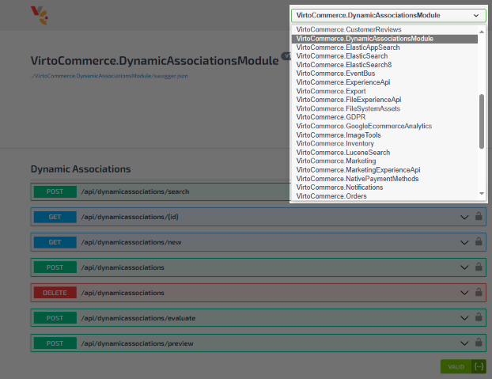
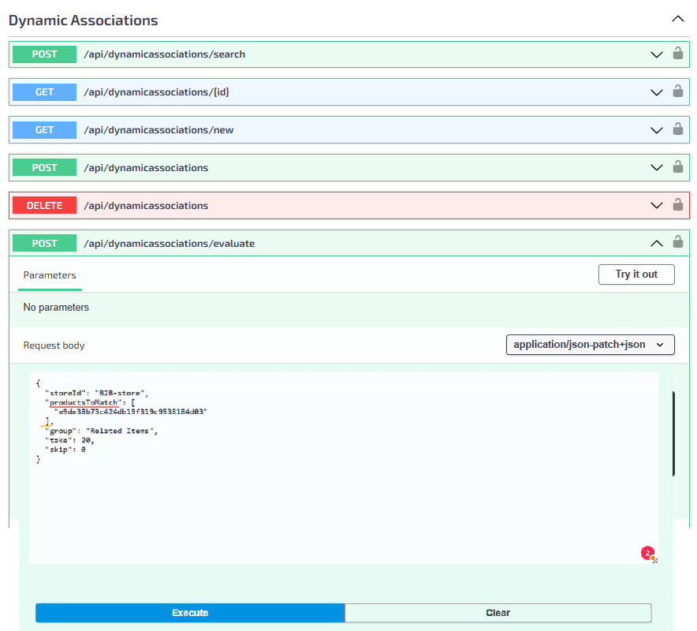
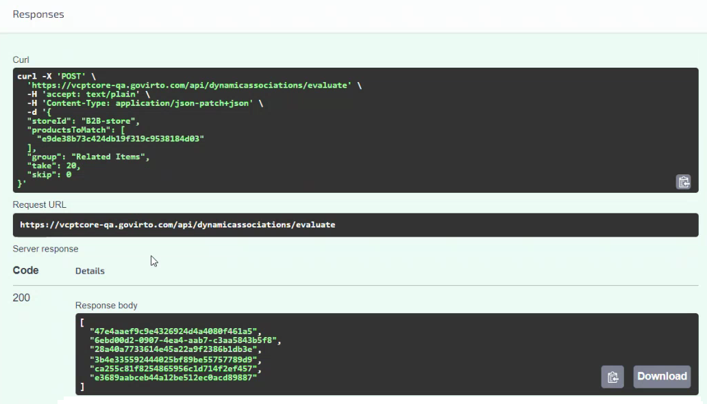

# REST API Testing

To test the created rule, use REST API testing as follows:

1. Let's say that according to the created rule you have 6 products to promote (products to diplay) as related products to 6 items (matching products).

    

1. Copy any of the matching products ids from the Catalog module.

    

1. Access the [REST API endpoint](https://virtostart-demo-admin.govirto.com/docs/index.html) and select **VirtoCommerce.DynamicAssociationsModule** from the drodown list.

    

1. Go to **/api/dynamicassociations/evaluate**, paste the Id of the product from clipboard, and complete the request as follows:

    

1. Click **Execute** to receive the response:

    

You can see, the rule is correct returning 6 relatde items that will be displayed with the specified item. 