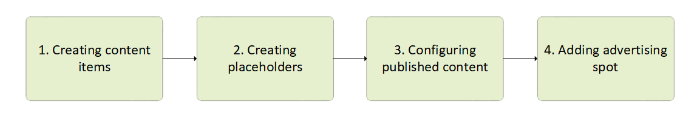

# Dynamic Content

With the Dynamic Content feature you can create personalized shopping experiences for your customers. You can deliver customized elements of the shopping journey based on specific conditions or context.

When presenting Dynamic Content to your customers, consider the following:

* The type of content you intend to display.
* The target audience that will view this content.
* The time frame during which the content will be visible.
* The content's location, indicating which part of the webpage will house the content in question.

Dynamic Content is configurable via the Virto Commerce Platform Manager, enabling your marketing team to set it up without the need for developers or system administrators. For assets like images or Flash animations, a graphic designer may be required to create and upload the files. However, once this step is completed, your marketing team can configure rules for content display without any technical assistance.

Dynamic Content consists of four independent components:

| Component           	| Purpose                                                                                                                   	| 
|---------------------	|------------------------------------------------------------------------------------------------------------------------------	|
| Dynamic Content     	| Provides name and description of the type of content display.                                                                 | 
| Published Content   	| Includes dynamic content items, along with the conditions governing when they appear.                                         | 
| Content Type        	| Offers a template to define the dynamic content type, that is, how a particular content type is displayed and what is required to display it. 	|
| Content Placeholder 	| Represents a designated area in a template where dynamic content can be inserted.                                             | 

The process of bringing marketing content online looks as follows:

Managing dynamic content includes:

* [Managing content items](managing-content-items.md) to create your marketing banners, sliders, etc.
* [Managing content placeholders](managing-content-placeholders.md) to set content items locations on your website.
* [Managing content publishing](managing-published-content.md) to configure published content so that your banners or sliders could go online.
* [Adding advertising spots](advertising-spot.md) to publish your content and make it visible for your customers.
