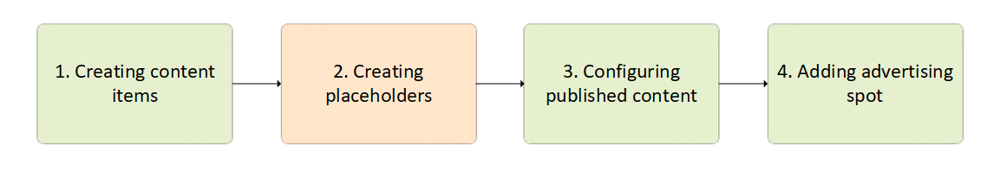
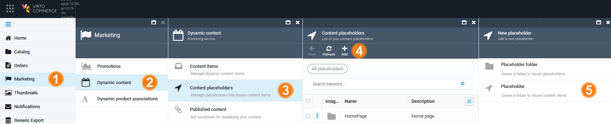
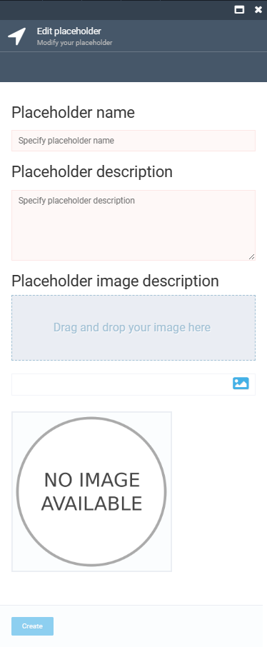

# Manage Content Placeholders

Managing content placeholders includes:

* [Creating placeholders.](managing-content-placeholders.md#creating-new-placeholder)
* [Editing placeholders.](managing-content-placeholders.md#edit-placeholder)
* [Deleting placeholders.](managing-content-placeholders.md#delete-placeholder)

## Create placeholder

The second step of bringing marketing content online is creating placeholders:

To create a placeholder:

1. Click **Marketing** in the main menu.
1. In the next blade, click **Dynamic content**.
1. In the next blade, click **Content placeholders**.
1. In the next **Content placeholders** blade, click **Add** in the toolbar.
1. In the next **New placeholder** blade, click **Placeholder**. 

	

1. Fill in the following fields:

	{: width="300"}

1. Click **Create** to save the changes.

The placeholder has been created.

!!! note
	Placeholders can be grouped into folders.

## Edit placeholder

To edit a placeholder:

1. Follow steps 1-3 from the instruction above.
1. Click the required placeholder in the **Content placeholders** blade.
1. Modify the placeholder in the next blade.
1. Click **Save** in the toolbar to save the changes.

Your modifications have been saved.

## Delete placeholder

1. Follow steps 1-3 from the instruction above.
1. Check the required placeholder(s) in the **Content placeholders** blade.
1. Click **Delete** in the toolbar.
1. Confirm the deletion.

The placeholder has been deleted.

 
 
********

    <a href="../managing-content-items">← Managing content items</a>
    <a href="../managing-published-content">Managing published content →</a>

