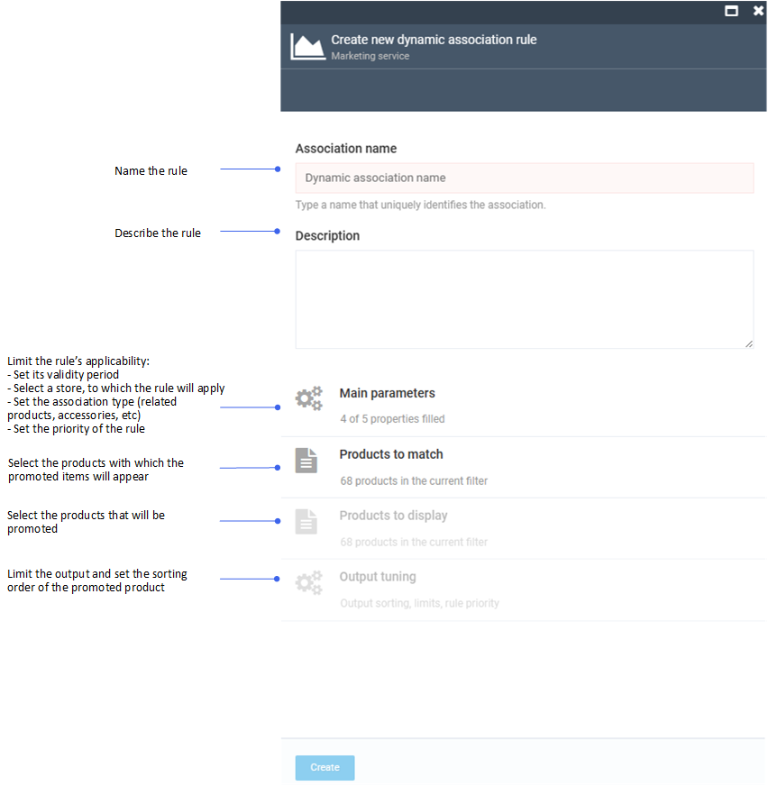

# Manage Dynamic Associations

To manage dynamic associations you need to create a rule according to which the products will be promoted:

1. In the main menu, click **Marketing**.
1. In the next blade, click **Dynamic product associations**. 
1. In the next blade, click **Add** in the toolbar.

    

1. Specify the following parameters:

    

    1. [Set main parameters for the rule.](managing-dynamic-associations.md#set-main-parameters-for-rule)
    1. [Manage products to match.](managing-dynamic-associations.md#manage-products-to-match)
    1. [Manage products to display.](managing-dynamic-associations.md#manage-products-to-display)
    1. [Tune the output.](managing-dynamic-associations.md#tune-output)

1. Click **Create** to save the changes.

The rule to manage dynamic associations has been created.

!!! note 
    Related products can also be set manually using the **Associations** widget of the [Catalog module](../catalog/managing-products.md).

## Set main parameters for rule

To set the applicability of the rule:

1. Click **Main parameters** in the **Create new dynamic association rule** blade. 
1. In the next blade:
    1. Switch the **is Active** option to on. 
    1. Limit the validity of the rule.
    1. Select the store where the promotion will be active. 
    1. Select or add a new group to display your promoted products. By default, choose between **Related products** and **Accessories**. 
    1. Set the priority of the newly created rule, where **1** is the highest.
1. Click **OK** to save the changes. 

The rule's applicability has been set.

## Manage products to match

To set the products with which the promoted item will appear:

1. Click **Products to match** in the **Create new dynamic association rule** blade. 
1. In the next blade:
    1. Click **Select categories** to select the product categories with which your product will be displayed, then click **Confirm** in the toolbar.

        

    1. Click **Select properties** to select properties from a dropdown list or add new ones. This will limit the products with which your product will be displayed to a specific brand, or material, or size. Then click **OK**.
    
        
    
    1. Click **Set value to selected properties** to specify the value of the selected properties, then click **OK**.

        

1. Click **Confirm** to save the changes.

The products with which the promoted item will appear has been set.

## Manage products to display

To set a product for promotion:

1. Click **Products to display** in the **Create new dynamic association rule** blade. 
1. In the next blade:
    1. Click **Select categories** to select a category to which the product to be promoted belongs, then click **Confirm** in the toolbar.

        

    1. Click **Select properties** to select properties from a dropdown list or add new properties. This will limit the products you want to promote to a specific brand, material, or size. Then click **OK**.

        

    1. Click **Set value to selected properties** to specify the value of the selected properties, then click **OK**.

        

1. Click **Confirm** to save the changes.
 
The product to promote has been selected.

## Tune output

To narrow down the output of associated products:

1. Click **Output tuning** in the **Create new dynamic association rule** blade. 
1. In the next blade:
    1. Select a sorting rule from a dropdown list.
    1. Select ascending or descending sorting order.
    1. Limit the number of the associated products displayed.

        

1. Click **OK** to save the changes.

The output range has been set.
