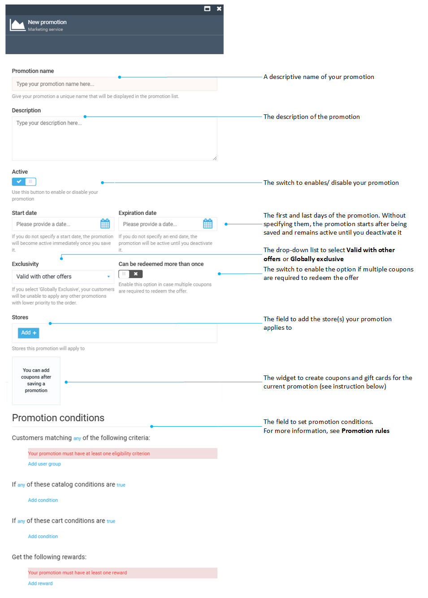

# Manage Promotions

Managing promotions includes:

* [Creating new promotions.](managing-promotions.md#creating-new-promotion)
* [Creating coupons and gift cards.](managing-promotions.md#create-coupons-and-gift-cards)
* [Editing promotions.](managing-promotions.md#edit-promotion)
* [Deleting promotions.](managing-promotions.md#delete-promotion)

## Create new promotion

!!! Note
	To create a promotion, the user must have the [Manage promotions permission](../security/managing-users.md).

1. Click **Marketing** in the main menu.
1. In the next blade, click **Promotions**.
1. In the **Promotions** blade, click **Add** in the toolbar.

	{: style="display: block; margin: 0 auto;" width="550"}

1. Fill in the following fields in the **New promotion** blade.

	{: style="display: block; margin: 0 auto;" }

1. Click **Create** to save the changes. 

Your newly created promotion appears in the promotions list.

{: width="25"} [Promotion conditions](promotion-rules.md)

## Create coupons and gift cards

Creating personal coupons is possible as of [VC Marketing module version 3.210.0](https://github.com/VirtoCommerce/vc-module-marketing/releases/tag/3.210.0) 

To create a coupon:

1. Click **Marketing** in the main menu.
1. In the next blade, click **Promotions**.
1. Click the required promotion in the **Promotions** blade.
1. In the new blade, click on the **Coupons** widget. 
1. In the **Coupons** blade, click **Add** to add a coupon manually or **Import** to import a coupon via CSV.

	{: style="display: block; margin: 0 auto;" }

=== "Add coupon"

	1. Fill in the following fields:

		{: style="display: block; margin: 0 auto;" }

	1. Click **Save** in the toolbar to save the changes.

=== "Import coupon from CSV file"

	1. Fill in the following fields:

		{: style="display: block; margin: 0 auto;" }

	1. Upload CSV file.
	1. Click **Start import**.

Your new coupon has been added to the promotion.

## Edit promotion

To edit a promotion:

1. Follow steps 1-3 from the instruction above.
1. Edit the required fields.
1. Click **Save** to save the changes.

The modifications have been saved.

## Delete promotion

To delete a promotion:

1. Follow steps 1-2 from the instruction above.
1. In the promotions list, check the promotion(s) you need to delete. 
1. Click **Delete** in the toolbar.
1. Confirm the deletion. 

The promotion has been removed from the promotions list.

 
 
********

    <a href="../promotions-overview">← Promotions overview</a>
    <a href="../combining-active-promotions">Promotion combination policies →</a>

