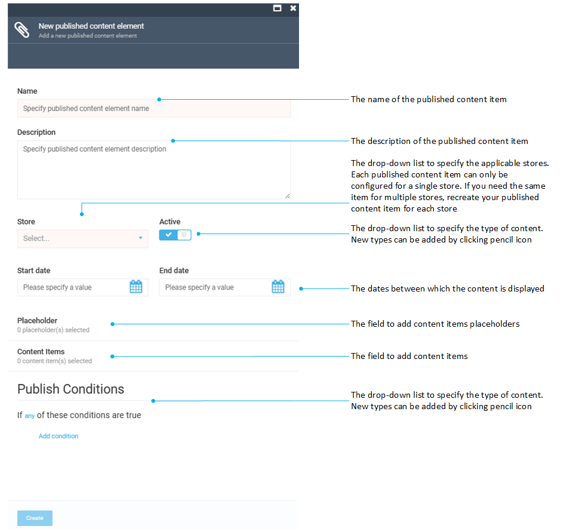

# Manage Published Content

The published content management feature determines the conditions under which your content is published or displayed on your website or online store.

This is the third step of bringing marketing content online:

{: style="display: block; margin: 0 auto;" }

## Add published content

To add a published content item:

1. Click **Marketing** in the main menu.
1. In the next blade, click **Dynamic content**.
1. In the next blade, click **Published content**.
1. In the next **Published content** blade, click **Add** in the toolbar.

	{: style="display: block; margin: 0 auto;" }

1. Fill in the following fields:

	{: style="display: block; margin: 0 auto;" }

The published content has been added.

{: width="25"} [Publish conditions](publish-conditions.md)

## Edit published content

To edit your published content:

1. Follow steps 1-3 from the instruction above.
1. Click the required content element in the **Published content** blade.
1. Modify your published content element in the next blade.
1. Click **Save** in the toolbar to save the changes.

Your modifications have been saved.

## Delete published content

1. Follow steps 1-3 from the instruction above.
1. Check the required placeholder(s) in the **Published content** blade.
1. Click **Delete** in the toolbar.
1. Confirm the deletion.

The content element has been deleted.

 
 
********

    <a href="../managing-content-placeholders">← Managing content placeholders</a>
    <a href="../publish-conditions">Publishing conditions →</a>

