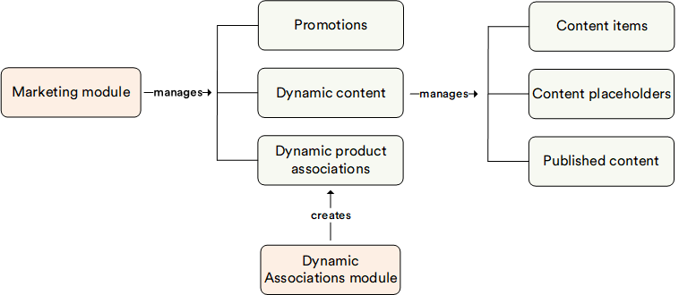

# Overview

The Virto Commerce Marketing module is dedicated to managing the various marketing activities, campaigns and promotions that you can run within your online store.

## Key features
The diagram below illustrates the interconnections among various key entities within the Marketing module:

With the Marketing module, you can:
 
* Manage [dynamic content](#dynamic-content) for the Storefront.
* Create and run [promotions](#promotions).

