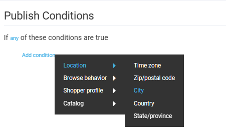
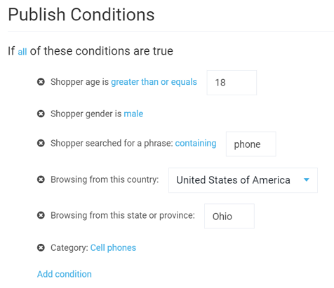

# Publishing Conditions 

The Virto's Marketing module allows you to customize the publishing conditions for your marketing content. With a variety of expressions and operators, you can tailor your content behavior to virtually any situation in your promotions and marketing campaigns.

{: style="display: block; margin: 0 auto;" }

The following conditions can be configured:

| Condition        	| Description                                                  	| Options                                                                 	|
|------------------	|--------------------------------------------------------------	|-------------------------------------------------------------------------	|
| Location         	| Defines the location of your website visitors.               	| Time zone  Zip/ postal code  City  Country  State/ province 	|
| Browse behavior 	| Defines the shopper's behavior.                              	| Shopper searched for ... in the store  User language is set to       	|
| Shopper profile  	| Targets the shoppers according to their profile information. 	| Shopper age is...  Shopper gender is...  User group contains...   	|
| Catalog          	| Specifies products or categories the content will apply to.  	| Specific category  Specific product                                  	|

The content can be displayed if **any** or **all** conditions are true.

The customization options are limitless and can be useful for a variety of promotions and campaigns.

## Example

The conditions below are configured to display content only to:

* Male customers.
* Older than 18.
* Residing in Ohio.
* Who searched for anything containing **phone** in the **Cell phones** category.

{: style="display: block; margin: 0 auto;" }
 

 
 
********

    <a href="../managing-published-content">← Managing published content</a>
    <a href="../advertising-spot">Adding advertising spot →</a>

