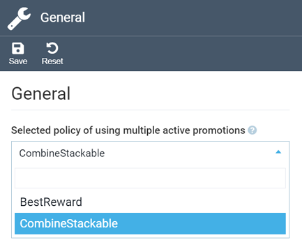

# Settings

In the Marketing module settings, you can configure promotion policies:

1. Click **Settings** in the main menu.
1. In the search field, type **Marketing** to find the settings related to the module.
1. Click **General** to select **BestReward** or **CombineStackable** policies from a drop-down list. **BestReward** is enabled by default.

	

1. Click **Save** in the toolbar to save the changes.
1. **Restart** the application for the new settings to come into effect.

The modifications have been saved.

 
 
********

    <a href="../promotion-rules">← Promotion rules</a>
    <a href="../dynamic-content-overview">Dynamic content overview →</a>

