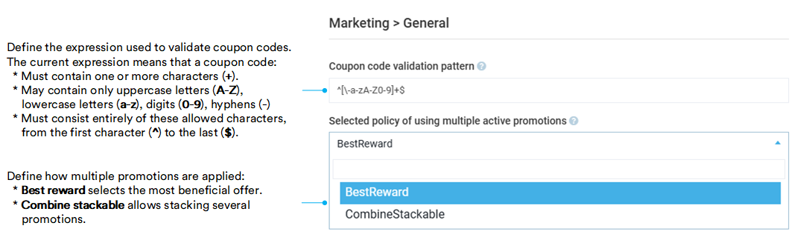

# Settings

In the Marketing module settings, you can configure promotion policies:

1. Click **Settings** in the main menu.
1. In the search field, type **Marketing** to find the settings related to the module.
1. Click **General** to configure the following:

	{: style="display: block; margin: 0 auto;" }

1. Click **Save** in the toolbar to save the changes.

Your modifications have been applied.

 
 
********

    <a href="../promotion-rules">← Promotion rules</a>
    <a href="../dynamic-content-overview">Dynamic content overview →</a>

