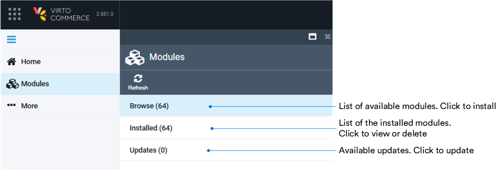
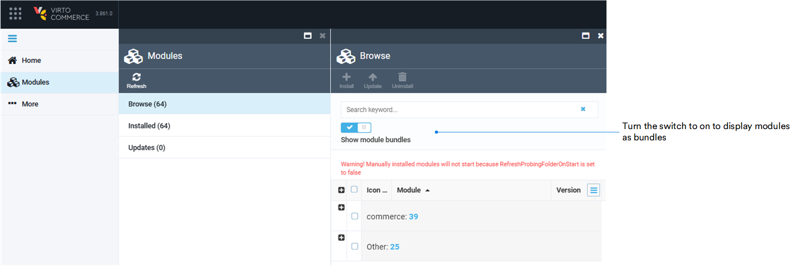

# Modules Installation

The modules can be accessed only by admin user who can view view the installed modules, new updates, install new modules or remove the installed ones.

Clicking the **Modules** in the main menu opens the **Modules** blade. The blade resembles the layout of Visual Studio and enhance the user experience:

Within the **Browse** section, you can organize and display modules more clearly according to their purpose:

All the Virto Commerce modules are marked with {: width="25"}.