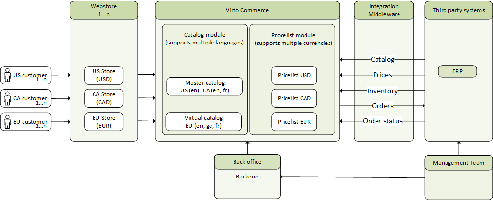

# B2B Multi-Regional Ecommerce Architecture

Expansion into new regions poses significant challenges for B2B ecommerce businesses, particularly concerning associated costs before local market sales commence. Virto Commerce offers a solution to mitigate redundant costs associated with duplicating platforms for each regional market. This article delineates an architectural blueprint for multi-regional stores leveraging the Virto Commerce platform.

## Potential use cases

This solution targets multi-regional support with a unified master catalog and centralized management across multiple regions, facilitating scenarios such as:

- Multi-regional stores with identical or similar product assortments.
- Multi-country stores with similar assortments but distinct pricelists denominated in different currencies.
- Multi-country stores with comparable assortments but divergent localized content, such as item names and descriptions.
- Hybrid configurations combining the above scenarios.

## Architecture diagram

The architecture diagram shows three webstores aimed at different regions, all interfacing with a shared Virto Commerce backend that is integrated with various third-party systems such as ERPs or PIMs.

Each webstore serves as a salespoint tailored to its respective region, employing localized language, catalog properties, descriptions, and currency pricing.

The Virto Commerce backend comprises essential modules (Catalog and Pricelist modules in the diagram).

The Catalog module supports master catalogs, which are physical catalogs that store the master data of product items. These catalogs can be directly assigned to one or multiple regions. However, if the structure and contents of the master catalog do not meet the region's requirements, the Virto Commerce catalog module supports a virtual catalog model. A virtual catalog can be created for a specific region, such as the EU, and contain a subset of items from the master catalog.

## Components overview

The following modules are included to discuss a multi-regional ecommerce solution.

* **Webstore** is a sales point for the store, which can be a website, application, or other platform.
* **Virto Commerce** is a platform with native, extended, or new customer-specific modules.
* **The catalog module** is responsible for running CRUD operations to build the seller's product catalog structure.
* **The master catalog** contains the seller's catalog assortment master data, which can be uploaded via .CSV file import or RESTful API. The master catalog can be enhanced with additional properties through the backoffice and can be utilized for multiple stores configured in Virto Commerce. In the scheme, the master catalog is directly used for US and CA webstores.
* **The virtual catalog** is a tool that can be used to build a subset or combination of items from one or more master catalogs. This tool adjusts the catalog structure to meet specific regional requirements. The virtual catalog can be created and used specifically for the EU region webstore in the architecture scheme.
* **The pricelist module** is responsible for managing specific webstore, region, catalog, customer group, or specific customer prices.  It supports multi-currency, allowing for the uploading and management of pricelists in different currencies for different regions. The scheme manages pricelists for three different currencies: USD for the US webstore, CAD for the CA webstore, and EUR for the EU webstore.
* **Integration middleware** is used to transform API messages to support the exchange of master data or transactional data between Virto Commerce and third-party systems. Logic App can be used as integration middleware.
* **Third-party systems** include ERP, PIM, and other systems.

## Conclusion

Virto Commerce architecture enables companies to quickly and affordably expand their regional presence. They can launch stores in different regions with different languages and currencies while maintaining a single ecosystem of applications and a unified process for order processing and customer service. One of the significant advantages of Virto Commerce architecture is the ability to scale ecommerce to regions without multiple platform installations for regional markets. This approach saves on IT infrastructure and personnel costs. The IT team can serve the platform for all markets, adding only staff with language skills as needed to support local customers. In contrast, other competing platforms require duplicating the ecommerce platform for each new region, resulting in unnecessary duplication of IT resources and team costs. The Virto Commerce architecture naturally avoids cost duplication. When launching a new ecommerce business in different regions, the infrastructure that serves it remains the same or grows insignificantly. To scale the Virto Commerce ecommerce platform to new regional markets, it is recommended to install it at a cloud provider such as Microsoft Azure, AWS, Google Cloud, or Alibaba Cloud.