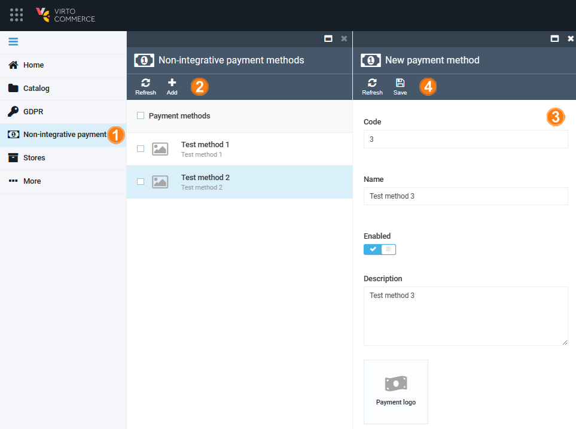

# Manage Non-Integrative Payment Methods

Managing non-integrative payment methods includes:

* [Creating new methods.](managing-native-payment-methods.md#create-non-integrative-payment-method)
* [Viewing and editing methods details.](managing-native-payment-methods.md#view-and-edit-non-integrative-payment-methods-details)
* [Deleting methods.](managing-native-payment-methods.md#delete-non-integrative-payment-method)

## Create Non-Integrative Payment Method

To create a new non-integrative payment method: 

1. Click **Non-integrative payment methods** in the main menu.
1. In the next blade, click **Add** in the top toolbar.
1. In the next blade, specify the following details:

    * **Code**: A unique Id for the payment method within the system. It helps distinguish one payment method from another and is used for internal processing.

    !!! note
        Once created, the code for a payment method can't be altered. It must be unique, not just among other non-integrative methods, but across all existing payment methods in the system.

    * **Name**: The name of the payment method, which is displayed to users during the checkout process. It helps users understand the payment option they are selecting.
    * **Description**: A brief explanation of the payment method, providing additional information or details about its features, usage, or any specific instructions. This helps users make informed decisions when choosing a payment method.

1. Click **Save** in the top toolbar to save the changes.

Your new method has been added to the list.

## View and Edit Non-Integrative Payment Methods Details

To view the details of the existing non-integrative payment methods:

1. Click **Non-integrative payment methods** in the main menu.
1. The next blade displays the list of available methods. Select the required method.
1. The next blade displays the details of the selected method. Here you can:
    * Edit its code, name, and description.
    * Enable/ disable it.
    * Add or edit its logo by borwsing your files to the next blade.

1. Click **Save** in the top toolbar to save the changes, if any.

The changes have been saved.

## Delete Non-Integrative Payment Method

To delete a non-integrative method:

1. Click **Non-integrative payment methods** in the main menu.
1. In the next blade, check the required method.
1. Click **Delete** in the top toolbar.

The selected method has been deleted.

