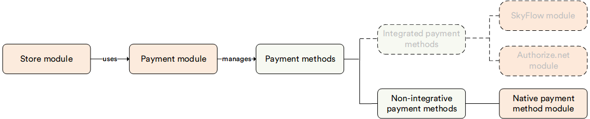

# Overview

The **Native Payment Methods** module allows you to create **non-integrative payment methods** without any code changes. Such methods can provide any functionality similar to the manual test payment method. At the same time, they can have different code parts, names, descriptions, and logos, and can be useful for designating different types of cash payments.

## Key features

The diagram below illustrates the functionality of the Native payment methods module:

