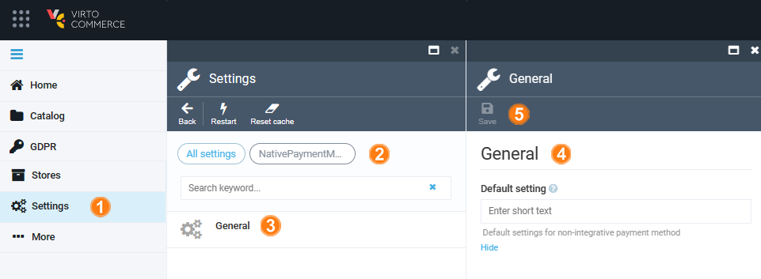

# Settings

To configure native payment methods settings:

1. Click **Settings** in the main menu.
1. In the search field of the next blade, type **NativePaymentMethods** to find the settings related to the module.
1. Click **General**. 
1. In the next blade, configure default setting.
1. In the top toolbar, click **Save** to save the changes.

The settings have been configured.

{: width="25"} [Payment Methods Settings](../payment/managing-payment-methods.md)

 
 
********

    <a href="../managing-native-payment-methods">← Managing native payment methods</a>
    <a href="../../authorize-net/overview">Authorize.net module overview →</a>

