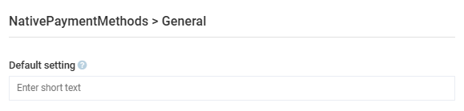

# Settings

To configure native payment methods settings:

1. Click **Settings** in the main menu.
1. In the search field of the next blade, type **NativePaymentMethods** to find the settings related to the module.
1. Click **General**. 
1. In the next blade, configure the default setting:

    {: style="display: block; margin: 0 auto;" }

1. In the toolbar, click **Save** to save the changes.

Your modifications have been applied.

{: width="25"} [Payment methods settings](../payment/managing-payment-methods.md)

 
 
********

    <a href="../managing-native-payment-methods">← Managing native payment methods</a>
    <a href="../../authorize-net/overview">Authorize.net module overview →</a>

