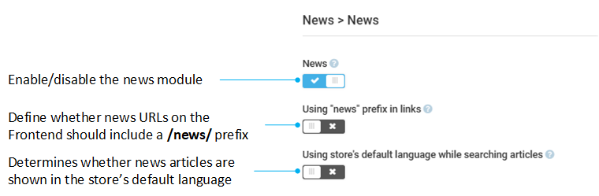

# Settings

To open the News module settings:

1. Click **Settings** in the main menu.
1. In the search field of the next blade, type **News** to find the settings related to the module, then click **News**.
1. In the next blade, configure the following settings:

    {: style="display: block; margin: 0 auto;" }

1. Click **Save** in the toolbar.

Your settings have been applied.

 
 
********

    <a href="../managing-news">← Managing news</a>
    <a href="../../notifications/overview">Notifications module overview →</a>

