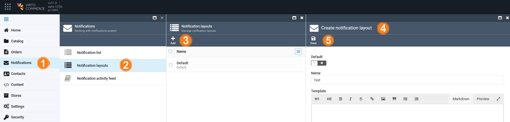

# Notification Layouts

The **Notification layout** option allows you to manage the existing layouts and add new ones. Layouts define the formatting for your [notification templates](notification-templates.md) and mostly use HTML and CSS languages, so you might need help from your web designers to configure them.

To create a new notification layout:

1. In the main menu, click **Notifications**.
1. In the next **Notifications** blade, click **Notification layouts**.
1. In the next blade, click **Add** in the toolbar.  
1. In the **Create notification layout** blade, paste or write your layout.
5. Click **Save** in the toolbar to save the changes. 

Your new layout has been added to the layouts list within the [Notification template](notification-templates.md) blade.
