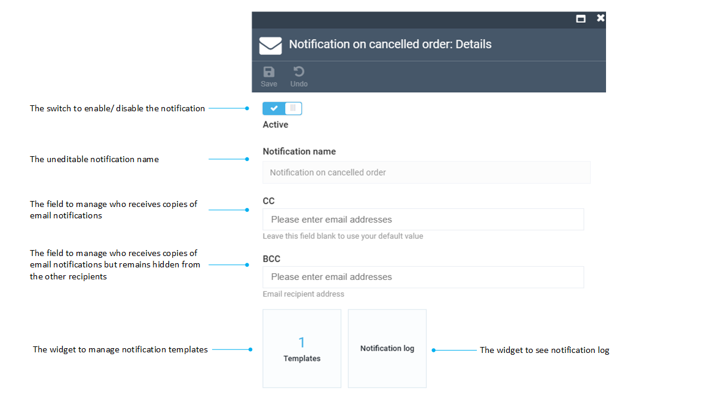
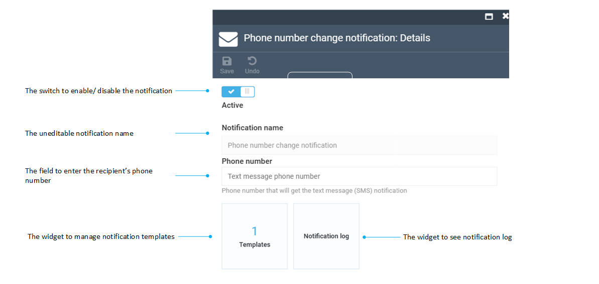

# Notification list

The notification list shows all existing notifications that are currently configured for your store. This includes all our out-of-the-box notifications, as well as your custom ones, if any, including

{: width="20"} [Email notifications.](notification-list.md#email-notifications)

{: width="25"} [Text notifications.](notification-list.md#text-notifications)

These are two types of notifications Virto Commerce provides by default. Your development team can configure other types that will notify your customers through other communication channels, such as messengers.

## Email notifications

To view the list of available email notifications:

1. Click **Notifications** in the main menu.
1. In the next **Notifications** blade, click **Notification list**.
1. In the next blade, select the required notification with {: width="20"} next to it.  

!!! info
	Both the **CC** and **BCC** fields are provided for testing purposes only, for example, to see if your email notification works correctly and can reach the specified addresses. In a production environment, the emails are programmed to go to the appropriate customer addresses, and you don't need to enter them manually.

## Text notifications

To view the list of available email notifications:

1. Click **Notifications** in the main menu.
1. In the next **Notifications** blade, click **Notification list**
1. In the next blade, select the required notification with {: width="25"} next to it.  

!!! info
	The phone number field is for testing purposes only.

{: width="25"} [Managing notification templates](notification-templates.md)