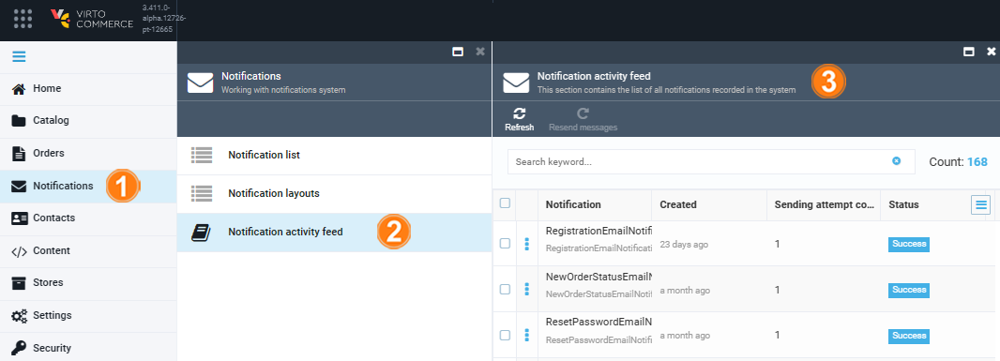

# Notification Log

You can view a log of:

* A specific notification via the [Notification log](notification-log.md#notification-log) widget.
* All the notifications sent via the [Notification activity feed](notification-log.md#notification-activity-feed).

## View notification log

To view the log of a specific notification:

1. Click **Notifications** in the main menu.
1. In the next **Notifications** blade, click **Notification list**.
1. In the next blade, select the required notification.
1. In the next blade, click on the **Notification log** widget.
1. The next blade shows whether the notification was delivered successfully or failed when it was sent.

{: style="display: block; margin: 0 auto;" }

## Notification activity feed

To view the log of all the notifications sent:

1. Click **Notifications** in the main menu.
1. In the next **Notifications** blade, click **Notification activity feed**.
1. The next blade shows the notifications log.

{: style="display: block; margin: 0 auto;" width="800"}

To review email messages sent to clients you can preview the email notifications: 

  
  

    <iframe loading="lazy" class="sl-demo" src="https://virtocommerce.storylane.io/demo/arlxwi7vaeqr?embed=inline" name="sl-embed" allow="fullscreen" allowfullscreen style="position:absolute;top:0;left:0;width:100%!important;height:100%!important;border:1px solid rgba(63,95,172,0.35);box-shadow: 0px 0px 18px rgba(26, 19, 72, 0.15);border-radius:10px;box-sizing:border-box;"></iframe>
  

 
 
********

    <a href="../notification-layouts">← Notification layouts</a>
    <a href="../notification-templates">Notification templates →</a>

