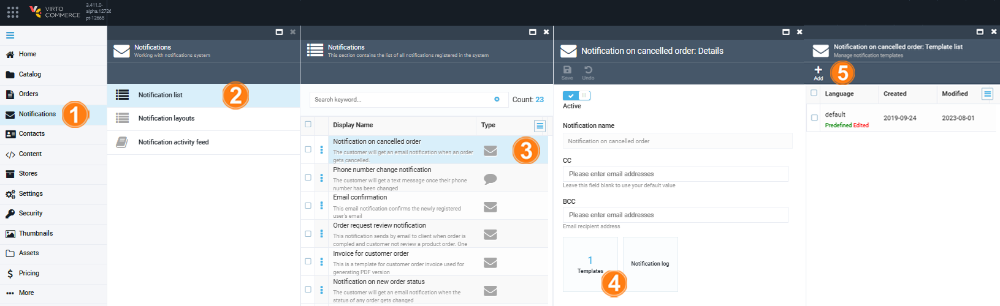
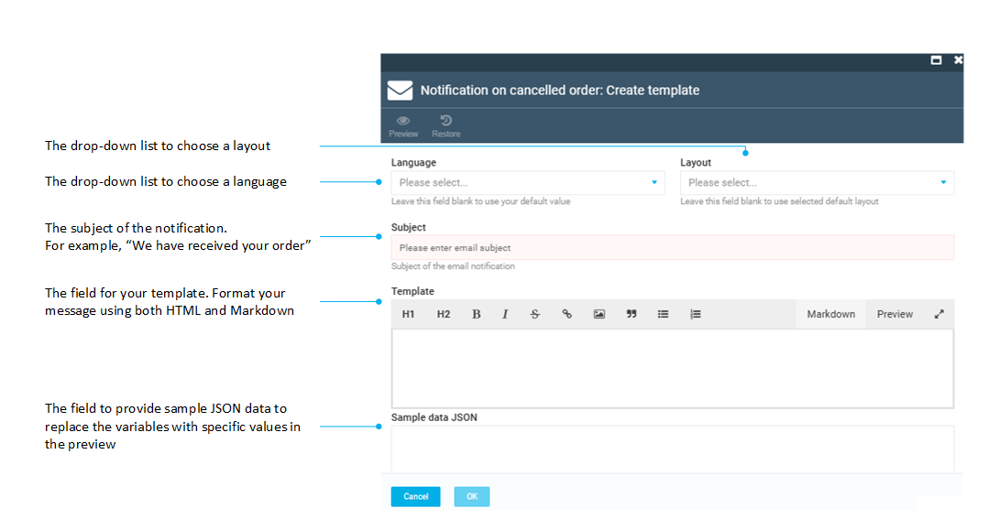
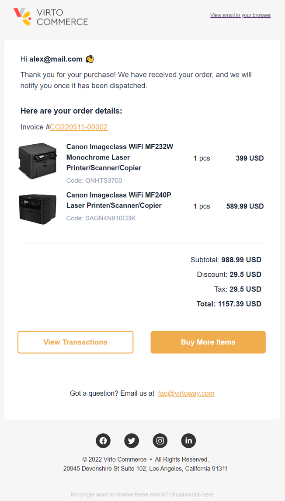

# Notification Templates

Templates are containers that hold all the content for your notification, i.e. the message you send to your customer. 

To add a new notification template:

1. Click **Notifications** in the main menu.
1. In the next **Notifications** blade, click **Notification list**.
1. In the next blade, select the required notification.  
1. In the next blade, click on the **Templates** widget to open the **Manage notification templates** blade. The list of available templates appears.

	!!! info
		The **predefined** label means that this notification template is supplied out of the box. If you make changes to it and then save it, it will be replaced with your modified version, but the system will warn you:
		
		{: width="600"}
		
		The defaults can be restored any time by clicking **Restore** in the toolbar.

1. Click **Add** in the toolbar.

	

1. In the next blade, fill in the following fields:

	

	!!! warning
		The only way to create a new template for the notification you are working with is to create one for a different language. If you create a new template with the same language as the current template, such as Default or EN-US, it will override the current template.

1. Click **OK** to save the changes.

You template has been added to the templates list.

!!! tip
	The PDF invoices templates can also be managed through the notification template widget. For Linux users, we recommend using embedded images instead of external image links. The reason for this is that using embedded images leads to faster rendering times when generating the PDF.

??? Example
	{: width="550"}

