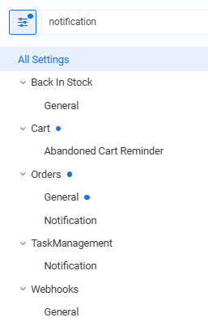

# Settings

To configure notification settings:

1. Click **Settings** in the main menu.
1. In the search field of the next blade, type **Notifications** to find the settings related to the module:

    {: style="display: block; margin: 0 auto;" }

1. As you can see, the notifications-related settings belong to various modules:

    * [Back-in-Stock module.](../back-in-stock/settings.md)
    * [Cart module.](../cart/settings.md)
    * [Orders module.](../order-management/settings.md)
    * [Task Management module.](../tasks/settings.md)
    * [Webhooks module.](../webhooks/settings.md)

1. Configure the settings and click **Save** in the toolbar.

Your modifications have been applied.

 
 
********

    <a href="../notification-templates">← Notification templates</a>
    <a href="../../page-builder/overview">Page Builder module overview→</a>

